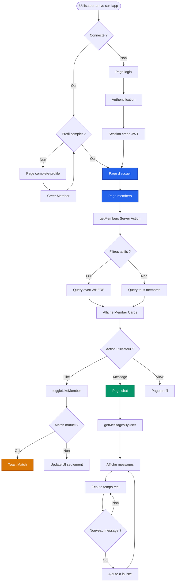
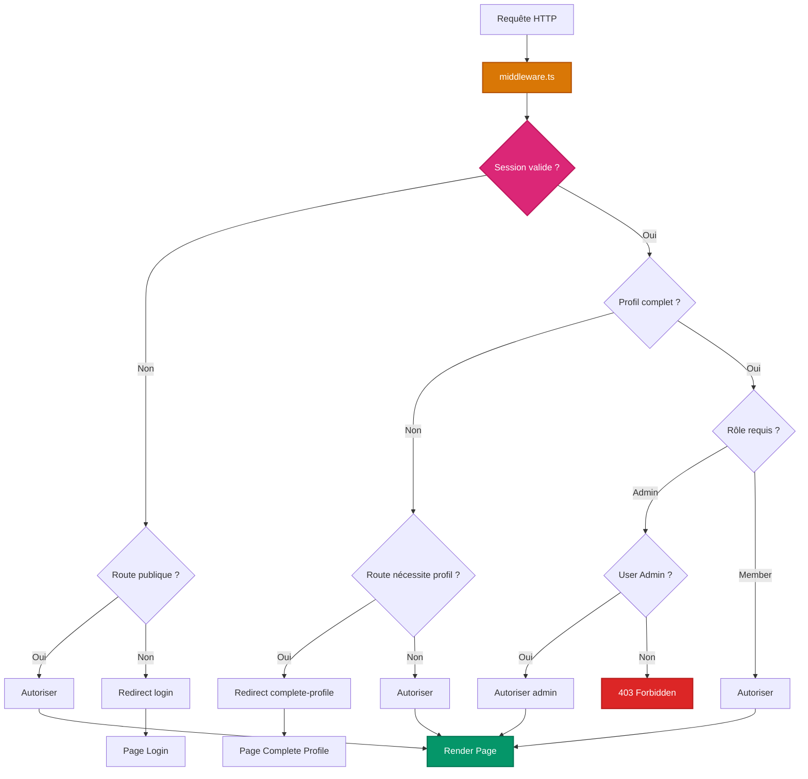

# Diagrammes d'Architecture - Next Match

Ce document contient tous les diagrammes d'architecture du projet en format Mermaid pour visualiser les flux de données, les composants et les interactions.

---

## Table des Matières

1. [Architecture Globale](#architecture-globale)
2. [Schéma de Base de Données](#schéma-de-base-de-données)
3. [Flux d'Authentification](#flux-dauthentification)
4. [Flux d'Inscription](#flux-dinscription)
5. [Flux de Messagerie Temps Réel](#flux-de-messagerie-temps-réel)
6. [Flux d'Upload d'Images](#flux-dupload-dimages)
7. [Flux de Modération](#flux-de-modération)
8. [Flux de Likes](#flux-de-likes)
9. [Architecture des Composants](#architecture-des-composants)
10. [Infrastructure et Services](#infrastructure-et-services)

---

## Architecture Globale

### Vue d'Ensemble du Système


---

## Schéma de Base de Données

### Relations Entre Tables


---

## Flux d'Authentification

### Login avec Email/Password


---

### Login avec Google OAuth


---

## Flux d'Inscription

### Inscription Complète


---

### Vérification Email


---

## Flux de Messagerie Temps Réel

### Envoi et Réception de Message


---

### Avec Supabase Realtime (Alternative)


---

## Flux d'Upload d'Images

### Upload avec Cloudinary


---

### Flux de Transformation d'Image Cloudinary


---

## Flux de Modération

### Système d'Approbation des Photos


---

## Flux de Likes

### Système de Likes Bidirectionnel


---

### Visualisation des Relations de Likes


---

## Architecture des Composants

### Hiérarchie des Composants (Page Members)


---

### Flux de Données avec Zustand


---

## Infrastructure et Services

### Architecture Cloud Complète


---

### Stack Actuelle vs Stack Recommandée


---

## Flux de Données - Cycle de Vie Complet

### Du Login au Message



---

## Architecture de Sécurité

### Middleware et Protection des Routes



---

## Flux Complet : Use Case Messagerie

### Scénario : Todd envoie message à Lisa


---

## Architecture des Hooks Personnalisés

### Dépendances entre Hooks

```mermaid
graph TD
    subgraph "Stores Zustand"
        MessageStore[useMessageStore<br/>Messages]
        PresenceStore[usePresenceStore<br/>Online Users]
        FilterStore[useFilterStore<br/>Filters State]
        PaginationStore[usePaginationStore<br/>Pagination]
    end
    
    subgraph "Hooks Personnalisés"
        UseMessages[useMessages<br/>Messaging Logic]
        UsePresence[usePresenceChannel<br/>Presence Logic]
        UseNotif[useNotificationChannel<br/>Notifications]
        UseFilters[useFilters<br/>Filter Logic]
    end
    
    subgraph "Services"
        Pusher[Pusher Client]
        ServerActions[Server Actions]
    end
    
    UseMessages --> MessageStore
    UseMessages --> Pusher
    UseMessages --> ServerActions
    
    UsePresence --> PresenceStore
    UsePresence --> Pusher
    
    UseNotif --> Pusher
    UseNotif --> MessageStore
    
    UseFilters --> FilterStore
    UseFilters --> PaginationStore
    
    style MessageStore fill:#d97706,stroke:#b45309,stroke-width:2px,color:#fff
    style UseMessages fill:#2563eb,stroke:#1e40af,stroke-width:2px,color:#fff
    style Pusher fill:#6b21a8,stroke:#581c87,stroke-width:2px,color:#fff
```

---

## Flux de Reset Password

### Processus Complet de Réinitialisation

```mermaid
sequenceDiagram
    participant U as Utilisateur
    participant FP as Forgot Password Page
    participant SA as Server Action
    participant DB as Database
    participant Resend as Resend
    participant Email as Email
    participant RP as Reset Password Page

    U->>FP: Entre email
    FP->>SA: generateResetPasswordEmail(email)
    
    SA->>DB: SELECT User WHERE email
    
    alt User Existe
        DB-->>SA: User found
        SA->>SA: generateToken(email, PASSWORD_RESET)
        SA->>DB: INSERT Token<br/>type: PASSWORD_RESET<br/>expires: +1 hour
        DB-->>SA: Token créé
        
        SA->>Resend: sendPasswordResetEmail(email, token)
        Resend->>Email: Email avec lien<br/>/reset-password?token=xxx
        Email-->>U: Reçoit email
        
        SA-->>FP: Success
        FP-->>U: "Check your email"
        
        U->>Email: Clic sur lien
        Email->>RP: Ouvre /reset-password?token=xxx
        RP->>RP: Affiche formulaire nouveau password
        U->>RP: Entre nouveau password
        
        RP->>SA: resetPassword(token, newPassword)
        SA->>DB: SELECT Token WHERE token AND !expired
        
        alt Token Valide
            DB-->>SA: Token valid
            SA->>SA: Hash new password (bcrypt)
            SA->>DB: UPDATE User SET passwordHash
            SA->>DB: DELETE Token
            SA-->>RP: Success
            RP->>RP: Redirect /login
            RP-->>U: "Password reset! Login now"
        else Token Invalid ou Expiré
            DB-->>SA: Not found or expired
            SA-->>RP: Error
            RP-->>U: "Invalid or expired token"
        end
        
    else User N'existe Pas
        DB-->>SA: Not found
        SA-->>FP: Success (pour sécurité)
        FP-->>U: "Check your email"
        Note over FP,U: Message identique même si email invalide<br/>pour éviter énumération des emails
    end
```

---

## Déploiement et CI/CD

### Workflow de Déploiement sur Vercel

```mermaid
graph LR
    subgraph "Développement Local"
        Dev[Développeur]
        Git[Git Local]
    end
    
    subgraph "GitHub"
        Repo[Repository]
        PR[Pull Request]
    end
    
    subgraph "Vercel"
        Build[Build Process]
        Preview[Preview Deploy]
        Prod[Production Deploy]
    end
    
    subgraph "Services"
        DB[(Supabase)]
        Cloud[Cloudinary]
        Push[Pusher/Ably]
        Mail[Resend]
    end
    
    Dev -->|git commit| Git
    Git -->|git push| Repo
    Repo -->|Webhook| Build
    
    Build -->|Pour chaque commit| Preview
    Build -->|Sur main branch| Prod
    
    Preview --> DB
    Prod --> DB
    
    Prod --> Cloud
    Prod --> Push
    Prod --> Mail
    
    style Build fill:#1f2937,stroke:#111827,stroke-width:2px,color:#fff
    style Prod fill:#1f2937,stroke:#111827,stroke-width:2px,color:#fff
    style DB fill:#059669,stroke:#047857,stroke-width:2px,color:#fff
```

---

## Performance et Caching

### Stratégie de Cache Next.js

```mermaid
graph TD
    Request[Request /members] --> Cache{Cache<br/>valide ?}
    
    Cache -->|Oui| Cached[Retourne données<br/>en cache<br/>⚡ <10ms]
    
    Cache -->|Non| ServerAction[getMembers<br/>Server Action]
    
    ServerAction --> DB[Query Database<br/>⏱️ 100-300ms]
    DB --> Transform[Transform data<br/>mappings.ts]
    Transform --> Store[Store in cache<br/>revalidate: 60s]
    Store --> Return[Return data]
    
    Cached --> Display[Affiche UI]
    Return --> Display
    
    Update[Mutation<br/>updateMember] --> Invalidate[revalidateTag<br/>'members']
    Invalidate --> Cache
    
    style Cached fill:#059669,stroke:#047857,stroke-width:2px,color:#fff
    style ServerAction fill:#d97706,stroke:#b45309,stroke-width:2px,color:#fff
    style DB fill:#2563eb,stroke:#1e40af,stroke-width:2px,color:#fff
```

---

## Gestion des États

### State Management dans l'Application

```mermaid
graph TB
    subgraph "Server State"
        Database[(Database<br/>Source of Truth)]
        ServerActions[Server Actions<br/>Mutations]
    end
    
    subgraph "Client State - Zustand"
        Messages[MessageStore<br/>Messages en cours]
        Presence[PresenceStore<br/>Users online]
        Filters[FilterStore<br/>Active filters]
        Pagination[PaginationStore<br/>Page state]
    end
    
    subgraph "Local State - React"
        FormState[React Hook Form<br/>Form data]
        UIState[useState<br/>UI interactions]
    end
    
    subgraph "URL State"
        SearchParams[Search Params<br/>Filters, page]
    end
    
    subgraph "Auth State"
        Session[NextAuth Session<br/>User info]
    end
    
    Database --> ServerActions
    ServerActions --> Messages
    ServerActions --> Presence
    
    Filters <--> SearchParams
    Pagination <--> SearchParams
    
    Session --> UIState
    
    style Database fill:#2563eb,stroke:#1e40af,stroke-width:2px,color:#fff
    style Messages fill:#d97706,stroke:#b45309,stroke-width:2px,color:#fff
    style Session fill:#7c3aed,stroke:#6d28d9,stroke-width:2px,color:#fff
```

---

## Architecture de Sécurité - Layers

### Couches de Protection

```mermaid
graph TD
    Internet[Internet / Users] --> L1[Layer 1: Edge CDN<br/>Vercel Edge<br/>DDoS Protection]
    
    L1 --> L2[Layer 2: Middleware<br/>Auth Check<br/>Route Protection]
    
    L2 --> L3[Layer 3: Server Actions<br/>Session Validation<br/>Authorization]
    
    L3 --> L4[Layer 4: Input Validation<br/>Zod Schemas<br/>Data Sanitization]
    
    L4 --> L5[Layer 5: Prisma ORM<br/>SQL Injection Prevention<br/>Type Safety]
    
    L5 --> L6[Layer 6: Database<br/>Row Level Security RLS<br/>Encryption at Rest]
    
    L6 --> Data[(Données Sécurisées)]
    
    style L1 fill:#dc2626,stroke:#b91c1c,stroke-width:2px,color:#fff
    style L2 fill:#ea580c,stroke:#c2410c,stroke-width:2px,color:#fff
    style L3 fill:#d97706,stroke:#b45309,stroke-width:2px,color:#fff
    style L4 fill:#ca8a04,stroke:#a16207,stroke-width:2px,color:#fff
    style L5 fill:#65a30d,stroke:#4d7c0f,stroke-width:2px,color:#fff
    style L6 fill:#16a34a,stroke:#15803d,stroke-width:2px,color:#fff
    style Data fill:#059669,stroke:#047857,stroke-width:2px,color:#fff
```

---

## Comparaison des Architectures

### Architecture Monolithique vs Serverless

```mermaid
graph TB
    subgraph "Architecture Traditionnelle"
        direction LR
        MT[Serveur<br/>Node.js]
        MDB[(PostgreSQL<br/>Même serveur)]
        MRedis[(Redis<br/>Sessions)]
        
        MT --- MDB
        MT --- MRedis
    end
    
    subgraph "Architecture Next Match Serverless"
        direction LR
        Edge[Vercel Edge]
        Serverless[Next.js<br/>Serverless Functions]
        ExtDB[(Supabase<br/>Managé)]
        ExtCache[Vercel KV<br/>ou Cache Next.js]
        ExtRT[Supabase Realtime<br/>Managé]
        
        Edge --> Serverless
        Serverless --> ExtDB
        Serverless --> ExtCache
        Serverless --> ExtRT
    end
    
    style MT fill:#dc2626,stroke:#b91c1c,stroke-width:2px,color:#fff
    style Edge fill:#059669,stroke:#047857,stroke-width:2px,color:#fff
    style Serverless fill:#059669,stroke:#047857,stroke-width:2px,color:#fff
```

**Avantages Serverless :**
- ✅ Pas de serveur à gérer
- ✅ Scale automatique
- ✅ Paiement à l'usage
- ✅ 0 maintenance

---

## Flux de Données Optimisé

### Avec Caching et Optimistic Updates

```mermaid
sequenceDiagram
    participant U as User
    participant UI as Interface
    participant Cache as Next.js Cache
    participant SA as Server Action
    participant DB as Database
    participant RT as Realtime

    U->>UI: Action (Like profile)
    
    UI->>UI: Optimistic Update<br/>(❤️ devient rouge immédiatement)
    UI-->>U: Feedback instantané ⚡
    
    par Requête serveur en arrière-plan
        UI->>SA: toggleLikeMember()
        SA->>Cache: Check cache
        
        alt Cache Hit
            Cache-->>SA: Cached data
        else Cache Miss
            SA->>DB: Query
            DB-->>SA: Data
            SA->>Cache: Store result
        end
        
        SA->>DB: INSERT/DELETE Like
        DB-->>SA: Success
        SA->>Cache: Invalidate cache
        SA->>RT: Notify other user
        SA-->>UI: Confirmation
    end
    
    alt Success
        UI->>UI: Confirme optimistic update
    else Error
        UI->>UI: Rollback optimistic update
        UI-->>U: Affiche erreur
    end
```

---

## Résumé Architectural

### Principes de Design

```mermaid
flowchart TD
    Root["NEXT MATCH ARCHITECTURE"]
    
    Root --> Perf["1. PERFORMANCE"]
    Root --> Secu["2. SÉCURITÉ"]
    Root --> Scale["3. SCALABILITÉ"]
    Root --> DevXP["4. EXPÉRIENCE DEV"]
    Root --> UserXP["5. EXPÉRIENCE USER"]
    
    Perf --> P1["✓ Server Components"]
    Perf --> P2["✓ Caching agressif"]
    Perf --> P3["✓ Optimistic Updates"]
    Perf --> P4["✓ Image Optimization"]
    
    Secu --> S1["✓ Middleware Auth"]
    Secu --> S2["✓ Input Validation Zod"]
    Secu --> S3["✓ SQL Injection Protection"]
    Secu --> S4["✓ CSRF Protection"]
    
    Scale --> SC1["✓ Serverless Functions"]
    Scale --> SC2["✓ CDN Global Cloudinary"]
    Scale --> SC3["✓ Database Pooling"]
    Scale --> SC4["✓ Edge Computing"]
    
    DevXP --> D1["✓ TypeScript Strict Mode"]
    DevXP --> D2["✓ Prisma Type Safety"]
    DevXP --> D3["✓ Hot Reload Next.js"]
    DevXP --> D4["✓ Error Boundaries"]
    
    UserXP --> U1["✓ Temps Réel Pusher"]
    UserXP --> U2["✓ Feedback Immédiat"]
    UserXP --> U3["✓ Progressive Enhancement"]
    UserXP --> U4["✓ Responsive Design"]
    
    style Root fill:#1f2937,stroke:#111827,stroke-width:4px,color:#fff,font-size:16px
    style Perf fill:#2563eb,stroke:#1e40af,stroke-width:3px,color:#fff,font-size:14px
    style Secu fill:#dc2626,stroke:#b91c1c,stroke-width:3px,color:#fff,font-size:14px
    style Scale fill:#059669,stroke:#047857,stroke-width:3px,color:#fff,font-size:14px
    style DevXP fill:#d97706,stroke:#b45309,stroke-width:3px,color:#fff,font-size:14px
    style UserXP fill:#db2777,stroke:#be185d,stroke-width:3px,color:#fff,font-size:14px
```

---

## Stack Technique Visuelle

### Technologies et Relations

```mermaid
graph TB
    subgraph "Frontend"
        React[React 18<br/>Server Components]
        NextUI[NextUI<br/>Components]
        Tailwind[Tailwind CSS<br/>Styling]
        Framer[Framer Motion<br/>Animations]
        Icons[React Icons]
    end
    
    subgraph "Framework"
        Next[Next.js 14<br/>App Router]
        NextImg[next/image<br/>Optimization]
        NextFont[next/font<br/>Font Optimization]
    end
    
    subgraph "Backend"
        ServerActions[Server Actions]
        APIRoutes[API Routes]
        Middleware[Middleware]
    end
    
    subgraph "Data Layer"
        Prisma[Prisma ORM<br/>Type-safe queries]
        Zod[Zod<br/>Validation]
    end
    
    subgraph "Auth"
        NextAuth[NextAuth v5<br/>JWT Sessions]
        Bcrypt[bcryptjs<br/>Password Hashing]
    end
    
    subgraph "State"
        Zustand[Zustand<br/>Global State]
        RHF[React Hook Form<br/>Form State]
    end
    
    React --> Next
    NextUI --> React
    Tailwind --> React
    Framer --> React
    Icons --> React
    
    Next --> ServerActions
    Next --> APIRoutes
    Next --> Middleware
    Next --> NextImg
    Next --> NextFont
    
    ServerActions --> Prisma
    APIRoutes --> Prisma
    ServerActions --> Zod
    
    Middleware --> NextAuth
    NextAuth --> Bcrypt
    NextAuth --> Prisma
    
    React --> Zustand
    React --> RHF
    
    style Next fill:#1f2937,stroke:#111827,stroke-width:2px,color:#fff
    style React fill:#0ea5e9,stroke:#0369a1,stroke-width:2px,color:#fff
    style Prisma fill:#1f2937,stroke:#111827,stroke-width:2px,color:#fff
    style NextAuth fill:#7c3aed,stroke:#6d28d9,stroke-width:2px,color:#fff
```

---

## Flux de Données par Fonctionnalité

### Feature : Système de Filtres

```mermaid
flowchart TD
    User[Utilisateur]
    
    User -->|Change filter| UI["Filter UI"]
    
    UI -->|Update| Store["useFilterStore Zustand"]
    
    Store -->|Sync| URL["URL Search Params<br/>gender=female&age=18-100"]
    
    URL -->|Trigger| ServerComponent["MembersPage<br/>Server Component"]
    
    ServerComponent -->|Call| Action["getMembers<br/>with filters"]
    
    Action -->|Build query| Prisma["Prisma Query Builder"]
    
    Prisma -->|Execute| DB[("Database")]
    
    DB -->|Results| Transform["Transform data<br/>mappings.ts"]
    
    Transform -->|Return| Display["Display Members"]
    
    Display -->|Render| UserDisplay["Affichage Utilisateur"]
    
    style Store fill:#d97706,stroke:#b45309,stroke-width:2px,color:#fff
    style DB fill:#2563eb,stroke:#1e40af,stroke-width:2px,color:#fff
    style Prisma fill:#1f2937,stroke:#111827,stroke-width:2px,color:#fff
    style ServerComponent fill:#059669,stroke:#047857,stroke-width:2px,color:#fff
    style Action fill:#d97706,stroke:#b45309,stroke-width:2px,color:#fff
```

---

## Architecture de Déploiement

### Production sur Vercel

```mermaid
graph TB
    subgraph "Git Repository"
        Main[main branch]
        Dev[dev branch]
        Feature[feature branches]
    end
    
    subgraph "Vercel Platform"
        BuildMain[Production Build]
        BuildDev[Preview Build]
        BuildFeature[Preview Builds]
        
        ProdDeploy[Production<br/>nextmatch.vercel.app]
        PreviewDeploy[Preview<br/>feature-xyz.vercel.app]
    end
    
    subgraph "Edge Network"
        EdgeUS[Edge US]
        EdgeEU[Edge EU]
        EdgeAsia[Edge Asia]
    end
    
    subgraph "Services Production"
        ProdDB[(Supabase Prod)]
        ProdCloud[Cloudinary]
        ProdPush[Pusher/Ably]
        ProdMail[Resend]
    end
    
    Main -->|Push| BuildMain
    BuildMain --> ProdDeploy
    
    Dev -->|Push| BuildDev
    BuildDev --> PreviewDeploy
    
    Feature -->|PR| BuildFeature
    BuildFeature --> PreviewDeploy
    
    ProdDeploy --> EdgeUS
    ProdDeploy --> EdgeEU
    ProdDeploy --> EdgeAsia
    
    ProdDeploy --> ProdDB
    ProdDeploy --> ProdCloud
    ProdDeploy --> ProdPush
    ProdDeploy --> ProdMail
    
    style Main fill:#059669,stroke:#047857,stroke-width:2px,color:#fff
    style ProdDeploy fill:#1f2937,stroke:#111827,stroke-width:2px,color:#fff
    style ProdDB fill:#059669,stroke:#047857,stroke-width:2px,color:#fff
```

---

## Récapitulatif de la Documentation

**Vous avez maintenant 16 documents complets :**

```
documentation/
├── 01 - Guide démarrage
├── 02 - Configuration environnement  
├── 03 - Scripts automatisation
├── 04 - Architecture projet
├── 05 - Troubleshooting général
├── 06 - Docker Compose
├── 07 - Guide débutant sans Docker
├── 08 - Troubleshooting session (Cloudinary, Pusher)
├── 09 - Troubleshooting emails Resend
├── 10 - Analyse stack MVP
├── 11 - Optimisation performance
├── 12 - Comparaison Neon vs Supabase
├── 13 - Migration vers Supabase
├── 14 - Comparaison services emails
├── 15 - Comparaison services temps réel
└── 16 - Diagrammes architecture ← NOUVEAU !
```

**Documentation professionnelle COMPLÈTE avec diagrammes visuels !**

