# Arborescence du Projet et Rôle de Chaque Fichier

Ce document présente l'arborescence complète du projet avec le rôle détaillé de chaque fichier et dossier importants.

---

## Table des Matières

1. [Architecture Globale du Projet](#architecture-globale-du-projet)
2. [Dossier src/app - Routes et Pages](#dossier-srcapp---routes-et-pages)
3. [Dossier src/lib - Bibliothèques et Utilitaires](#dossier-srclib---bibliothèques-et-utilitaires)
4. [Dossier src/components - Composants Réutilisables](#dossier-srccomponents---composants-réutilisables)
5. [Dossier src/hooks - Hooks Personnalisés](#dossier-srchooks---hooks-personnalisés)
6. [Dossier prisma - Base de Données](#dossier-prisma---base-de-données)
7. [Fichiers de Configuration](#fichiers-de-configuration)
8. [Diagramme des Dépendances](#diagramme-des-dépendances)

---

## Architecture Globale du Projet

### Vue Racine

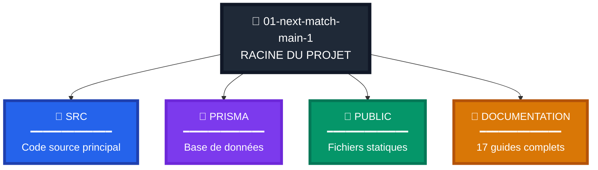

### Dossier src/

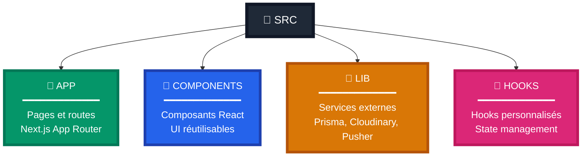

### Fichiers Configuration Racine

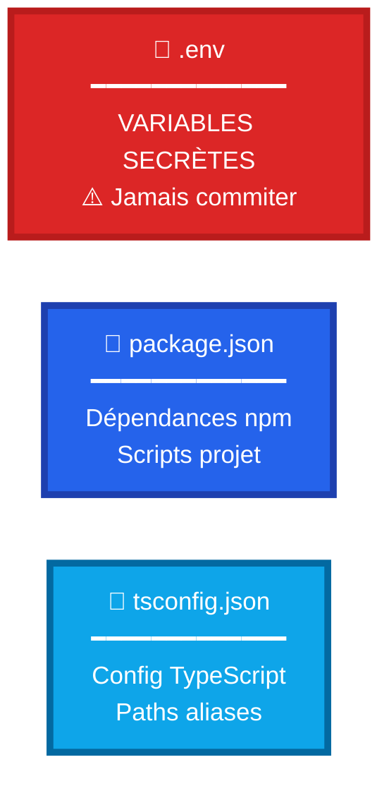

---

## Dossier src/app - Routes et Pages

### Routes Authentification

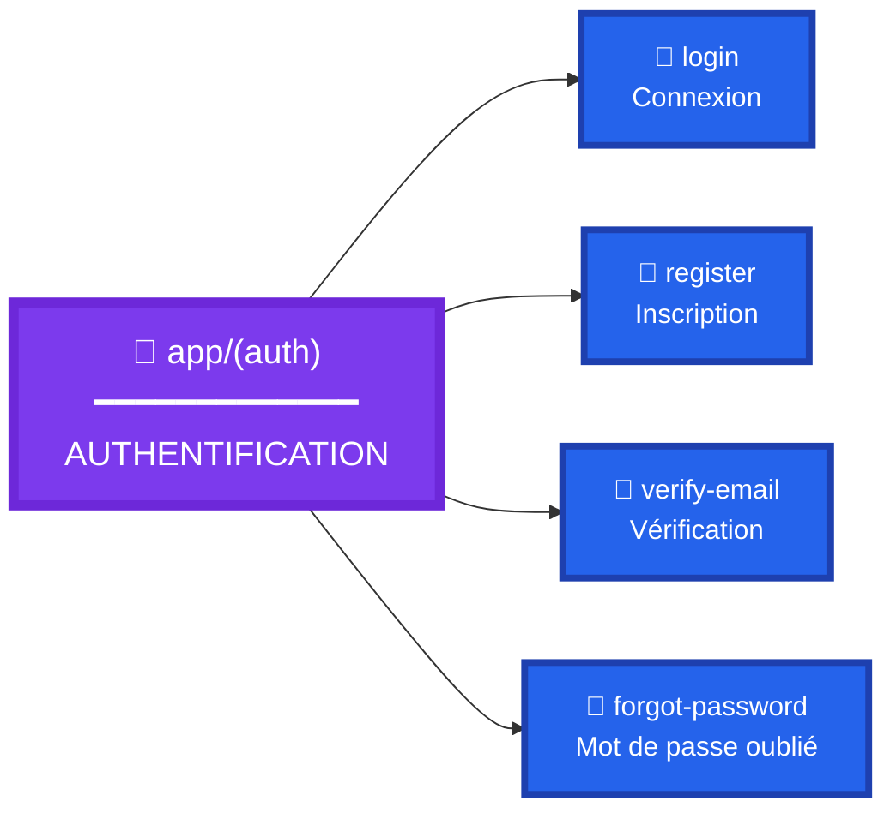

### Routes Membres

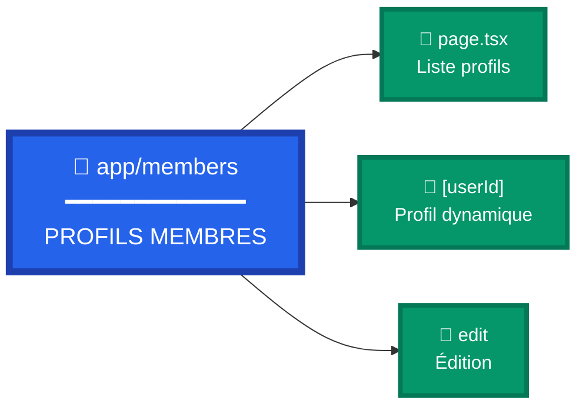

### Server Actions

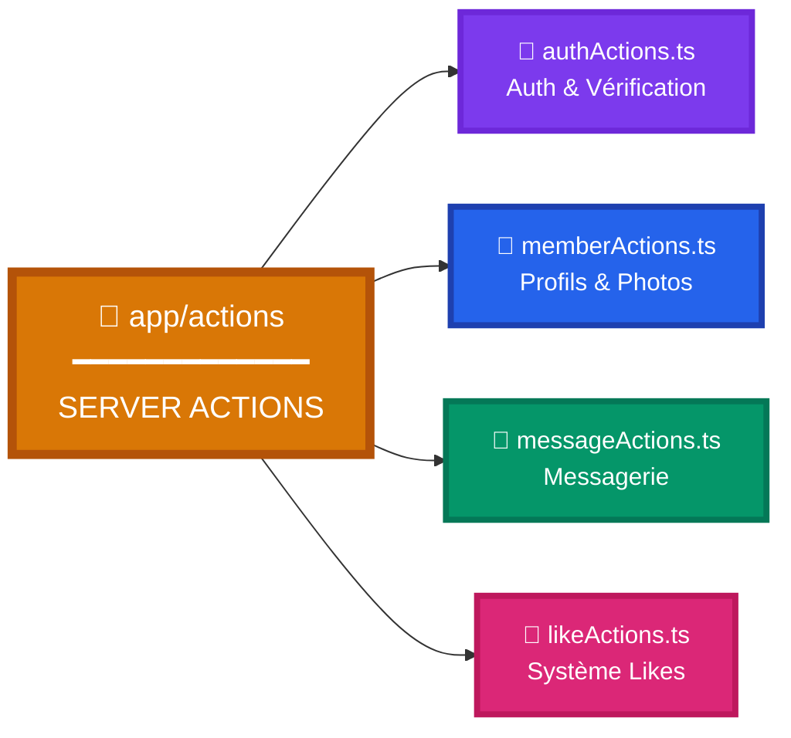

### API Routes

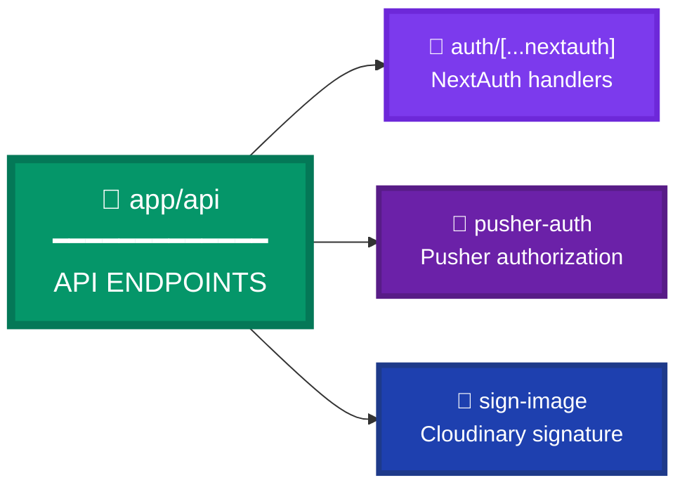

---

### Fichiers Importants de src/app

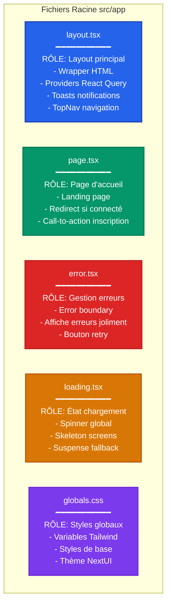

---

### Actions (Server Actions)

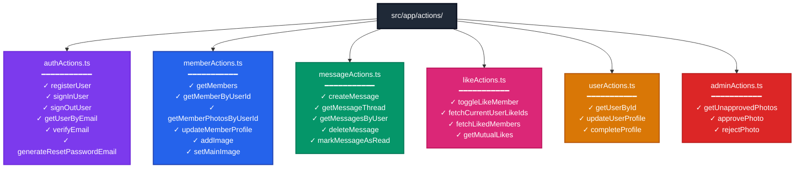

---

## Dossier src/lib - Bibliothèques et Utilitaires

### Structure et Rôles

### Services Externes (src/lib/)

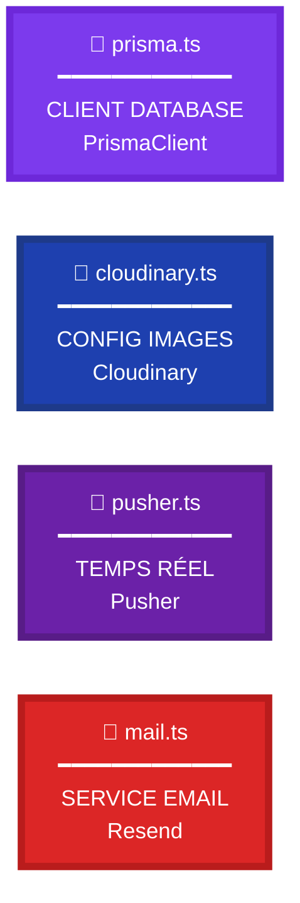

### Validation Zod (src/lib/schemas/)

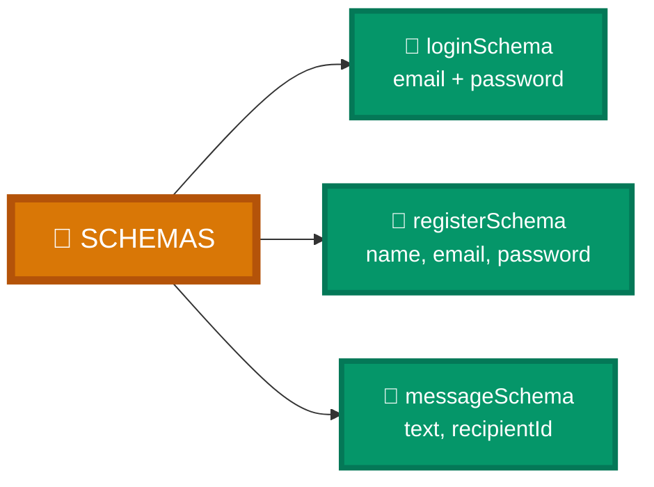

---

## Fichiers Critiques - Authentification

### auth.ts et auth.config.ts

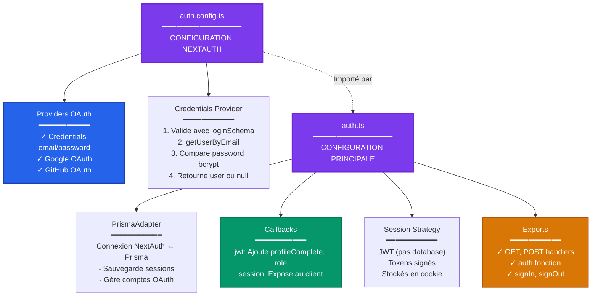

---

## Fichier middleware.ts

### Rôle et Flux

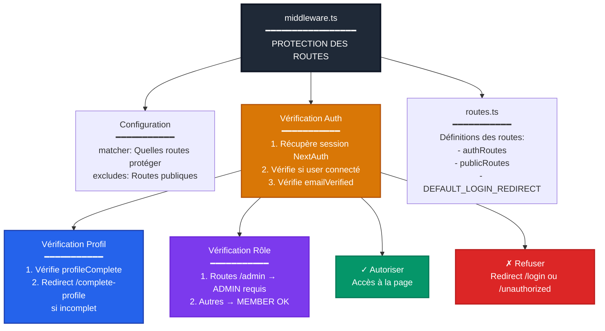

---

## Dossier src/components - Composants UI

### Composants Images

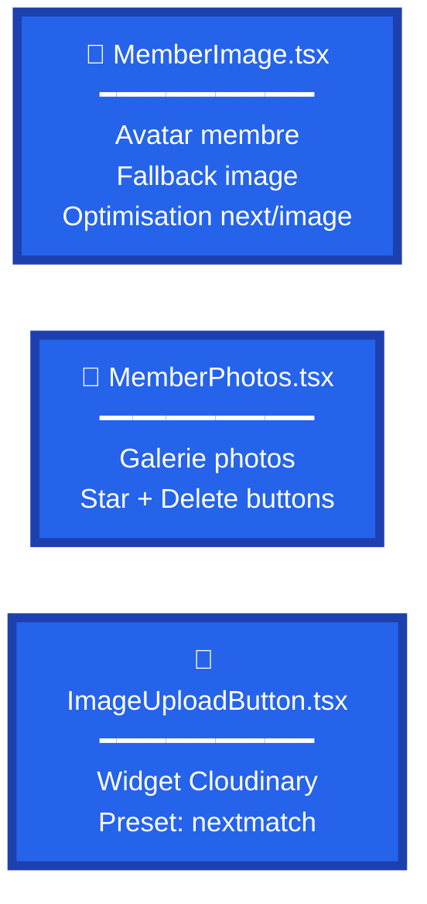

### Composants Boutons

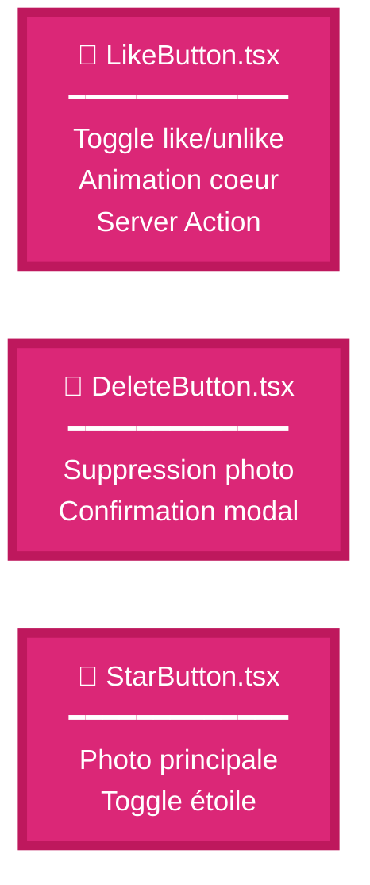

### Composants Navigation

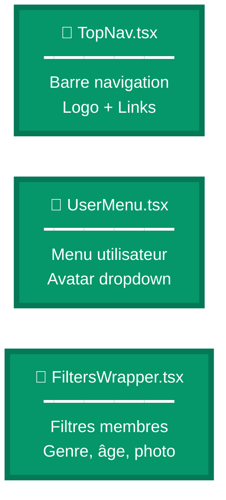

---

## Dossier src/hooks - Hooks Personnalisés

### Hooks Messagerie

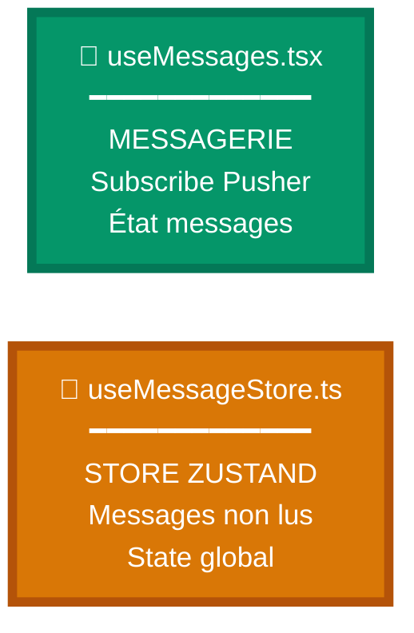

### Hooks Présence

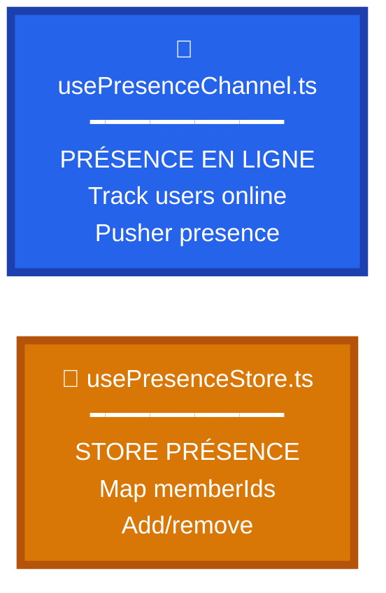

### Hooks Filtres

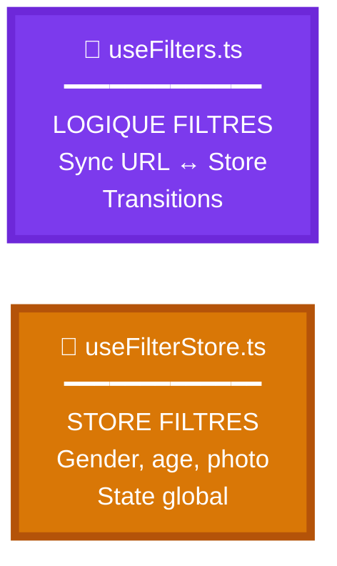

### Hook Notifications

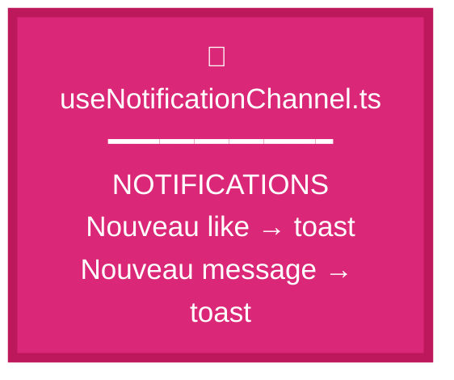

---

## Dossier prisma - Base de Données

### Structure Prisma

```mermaid
flowchart TD
    PRISMA["prisma/"]
    
    PRISMA --> SCHEMA["schema.prisma<br/>━━━━━━━━━━━━━━━━━<br/>SCHÉMA BASE DE DONNÉES<br/>━━━━━━━━━━━<br/>✓ Models: User, Member, Photo<br/>✓ Like, Message, Token, Account<br/>✓ Relations entre tables<br/>✓ Enums: Role, TokenType<br/>✓ Indexes et contraintes"]
    
    PRISMA --> SEED["seed.ts<br/>━━━━━━━━━━━━━━━━━<br/>PEUPLEMENT BASE<br/>━━━━━━━━━━━<br/>✓ Crée 10 profils test<br/>✓ 5 femmes + 5 hommes<br/>✓ 1 admin<br/>✓ Photos pour chacun<br/>✓ Password: 'password'"]
    
    PRISMA --> MEMBERS_DATA["membersData.ts<br/>━━━━━━━━━━━━━━━━━<br/>DONNÉES DE TEST<br/>━━━━━━━━━━━<br/>✓ Array de 10 profils<br/>✓ lisa, karen, margo...<br/>✓ todd, porter, mayo...<br/>✓ Infos: nom, age, ville"]
    
    PRISMA --> MIGRATIONS["migrations/<br/>━━━━━━━━━━━━━━━━━<br/>HISTORIQUE MIGRATIONS<br/>━━━━━━━━━━━<br/>✓ 20240413085447_initial<br/>✓ 20240413100752_added_is_approved<br/>✓ SQL de chaque migration"]
    
    SCHEMA --> MODELS["7 Models Prisma<br/>━━━━━━━━━━━"]
    
    MODELS --> USER_M["User<br/>Auth et base"]
    MODELS --> MEMBER_M["Member<br/>Profil public"]
    MODELS --> PHOTO_M["Photo<br/>Images"]
    MODELS --> LIKE_M["Like<br/>Relations"]
    MODELS --> MESSAGE_M["Message<br/>Messagerie"]
    MODELS --> TOKEN_M["Token<br/>Vérifications"]
    MODELS --> ACCOUNT_M["Account<br/>OAuth"]
    
    style PRISMA fill:#1f2937,stroke:#111827,stroke-width:3px,color:#fff
    style SCHEMA fill:#7c3aed,stroke:#6d28d9,stroke-width:3px,color:#fff
    style SEED fill:#059669,stroke:#047857,stroke-width:2px,color:#fff
    style MIGRATIONS fill:#2563eb,stroke:#1e40af,stroke-width:2px,color:#fff
    style MODELS fill:#d97706,stroke:#b45309,stroke-width:2px,color:#fff
```

---

## Fichiers de Configuration Racine

### Configuration du Projet

```mermaid
flowchart TD
    ROOT["Racine du projet"]
    
    ROOT --> ENV[".env<br/>━━━━━━━━━━━━━━━━━<br/>VARIABLES D'ENVIRONNEMENT<br/>━━━━━━━━━━━<br/>✓ DATABASE_URL<br/>✓ AUTH_SECRET<br/>✓ CLOUDINARY credentials<br/>✓ PUSHER credentials<br/>✓ RESEND_API_KEY<br/>⚠️ JAMAIS commiter !"]
    
    ROOT --> PACKAGE["package.json<br/>━━━━━━━━━━━━━━━━━<br/>DÉPENDANCES ET SCRIPTS<br/>━━━━━━━━━━━<br/>✓ dependencies: React, Next, Prisma<br/>✓ devDependencies: TypeScript, ESLint<br/>✓ scripts: dev, build, start<br/>✓ prisma seed config"]
    
    ROOT --> TSCONFIG["tsconfig.json<br/>━━━━━━━━━━━━━━━━━<br/>CONFIG TYPESCRIPT<br/>━━━━━━━━━━━<br/>✓ strict: true<br/>✓ paths aliases @ pour src/<br/>✓ target: ES2017<br/>✓ module: esnext"]
    
    ROOT --> NEXT_CONFIG["next.config.mjs<br/>━━━━━━━━━━━━━━━━━<br/>CONFIG NEXT.JS<br/>━━━━━━━━━━━<br/>✓ images: domains Cloudinary<br/>✓ experimental: staleTimes<br/>✓ env variables"]
    
    ROOT --> TAILWIND["tailwind.config.ts<br/>━━━━━━━━━━━━━━━━━<br/>CONFIG TAILWIND<br/>━━━━━━━━━━━<br/>✓ content paths<br/>✓ theme customization<br/>✓ plugins: NextUI"]
    
    ROOT --> POSTCSS["postcss.config.js<br/>━━━━━━━━━━━━━━━━━<br/>CONFIG CSS<br/>━━━━━━━━━━━<br/>✓ Tailwind plugin<br/>✓ Autoprefixer"]
    
    ROOT --> DOCKER["docker-compose.yml<br/>━━━━━━━━━━━━━━━━━<br/>CONFIG DOCKER<br/>━━━━━━━━━━━<br/>✓ Service PostgreSQL<br/>✓ Port 5432<br/>✓ Password: postgrespw"]
    
    style ROOT fill:#1f2937,stroke:#111827,stroke-width:3px,color:#fff
    style ENV fill:#dc2626,stroke:#b91c1c,stroke-width:3px,color:#fff
    style PACKAGE fill:#2563eb,stroke:#1e40af,stroke-width:2px,color:#fff
    style TSCONFIG fill:#0ea5e9,stroke:#0369a1,stroke-width:2px,color:#fff
    style NEXT_CONFIG fill:#1f2937,stroke:#111827,stroke-width:2px,color:#fff
    style TAILWIND fill:#0ea5e9,stroke:#0369a1,stroke-width:2px,color:#fff
```

---

## Flux de Dépendances - Fichiers Critiques

### Comment les Fichiers Interagissent

```mermaid
flowchart TD
    PAGE["Page Component<br/>src/app/membres/page.tsx"]
    
    PAGE --> ACTION["Server Action<br/>getMem bers"]
    
    ACTION --> PRISMA["prisma.ts<br/>Client DB"]
    
    PRISMA --> DB[("Base de Données<br/>Neon/Supabase")]
    
    ACTION --> MAPPINGS["mappings.ts<br/>Transform data"]
    
    MAPPINGS --> RETURN["Return to Page"]
    
    PAGE --> CARD["MemberCard.tsx<br/>Component"]
    
    CARD --> IMG["MemberImage.tsx"]
    CARD --> LIKE["LikeButton.tsx"]
    
    LIKE --> LIKE_ACTION["Server Action<br/>toggleLikeMember"]
    
    LIKE_ACTION --> PRISMA
    
    IMG --> PRESENCE["PresenceAvatar.tsx"]
    
    PRESENCE --> PRESENCE_HOOK["usePresenceChannel<br/>Hook"]
    
    PRESENCE_HOOK --> PRESENCE_STORE["usePresenceStore<br/>Zustand"]
    
    PRESENCE_HOOK --> PUSHER["pusher.ts<br/>Client"]
    
    PUSHER --> PUSHER_SERVICE["Pusher Service<br/>WebSocket"]
    
    style PAGE fill:#059669,stroke:#047857,stroke-width:2px,color:#fff
    style ACTION fill:#d97706,stroke:#b45309,stroke-width:2px,color:#fff
    style PRISMA fill:#7c3aed,stroke:#6d28d9,stroke-width:2px,color:#fff
    style DB fill:#2563eb,stroke:#1e40af,stroke-width:2px,color:#fff
    style CARD fill:#2563eb,stroke:#1e40af,stroke-width:2px,color:#fff
    style LIKE_ACTION fill:#d97706,stroke:#b45309,stroke-width:2px,color:#fff
    style PRESENCE_STORE fill:#d97706,stroke:#b45309,stroke-width:2px,color:#fff
    style PUSHER fill:#6b21a8,stroke:#581c87,stroke-width:2px,color:#fff
```

---

## Arborescence Complète avec Rôles

### Vue Détaillée du Projet

```mermaid
flowchart TD
    ROOT["📁 01-next-match-main-1"]
    
    ROOT --> SRC["📁 src<br/>Code source"]
    ROOT --> PRISMA_D["📁 prisma<br/>Base de données"]
    ROOT --> PUBLIC["📁 public<br/>Assets statiques"]
    ROOT --> DOC["📁 documentation<br/>16 guides"]
    ROOT --> NODE["📁 node_modules<br/>Dépendances"]
    
    SRC --> APP_D["📁 app<br/>App Router Next.js 14"]
    SRC --> COMP_D["📁 components<br/>Composants React"]
    SRC --> LIB_D["📁 lib<br/>Utilitaires"]
    SRC --> HOOKS_D["📁 hooks<br/>Hooks custom"]
    SRC --> TYPES_D["📁 types<br/>TypeScript"]
    SRC --> AUTH_FILE["📄 auth.ts<br/>Config NextAuth principale"]
    SRC --> AUTH_CONFIG_FILE["📄 auth.config.ts<br/>Providers OAuth"]
    SRC --> MIDDLEWARE_FILE["📄 middleware.ts<br/>Protection routes"]
    SRC --> ROUTES_FILE["📄 routes.ts<br/>Définitions routes"]
    
    APP_D --> AUTH_DIR["📁 auth<br/>Pages auth"]
    APP_D --> MEMBERS_DIR["📁 members<br/>Pages profils"]
    APP_D --> MESSAGES_DIR["📁 messages<br/>Messagerie"]
    APP_D --> LISTS_DIR["📁 lists<br/>Likes"]
    APP_D --> ADMIN_DIR["📁 admin<br/>Admin panel"]
    APP_D --> ACTIONS_DIR["📁 actions<br/>Server Actions"]
    APP_D --> API_DIR["📁 api<br/>API Routes"]
    APP_D --> LAYOUT_FILE["📄 layout.tsx<br/>Layout global"]
    APP_D --> PAGE_FILE["📄 page.tsx<br/>Home page"]
    APP_D --> GLOBALS_FILE["📄 globals.css<br/>Styles globaux"]
    
    LIB_D --> LIB_PRISMA["📄 prisma.ts<br/>Client DB"]
    LIB_D --> LIB_CLOUD["📄 cloudinary.ts<br/>Config images"]
    LIB_D --> LIB_PUSHER["📄 pusher.ts<br/>Config realtime"]
    LIB_D --> LIB_MAIL["📄 mail.ts<br/>Service email"]
    LIB_D --> LIB_TOKENS["📄 tokens.ts<br/>Gestion tokens"]
    LIB_D --> LIB_UTIL["📄 util.ts<br/>Functions utils"]
    LIB_D --> LIB_SCHEMAS["📁 schemas<br/>Validation Zod"]
    
    PRISMA_D --> SCHEMA_FILE["📄 schema.prisma<br/>Schéma BDD"]
    PRISMA_D --> SEED_FILE["📄 seed.ts<br/>Données test"]
    PRISMA_D --> MEMBERS_FILE["📄 membersData.ts<br/>Profils test"]
    PRISMA_D --> MIGRATIONS_DIR["📁 migrations<br/>Historique SQL"]
    
    PUBLIC --> IMAGES_DIR["📁 images<br/>Photos test f1-f5, m1-m5"]
    
    style ROOT fill:#1f2937,stroke:#111827,stroke-width:4px,color:#fff
    style SRC fill:#2563eb,stroke:#1e40af,stroke-width:3px,color:#fff
    style APP_D fill:#059669,stroke:#047857,stroke-width:2px,color:#fff
    style LIB_D fill:#d97706,stroke:#b45309,stroke-width:2px,color:#fff
    style PRISMA_D fill:#7c3aed,stroke:#6d28d9,stroke-width:2px,color:#fff
    style AUTH_FILE fill:#7c3aed,stroke:#6d28d9,stroke-width:2px,color:#fff
    style MIDDLEWARE_FILE fill:#dc2626,stroke:#b91c1c,stroke-width:2px,color:#fff
```

---

## Fichiers par Fonctionnalité

### Feature: Authentification

```mermaid
flowchart TD
    FEATURE["FEATURE: AUTHENTIFICATION"]
    
    FEATURE --> CONFIG_AUTH["📄 src/auth.config.ts<br/>━━━━━━━━━━━<br/>Providers (Credentials, Google, GitHub)"]
    
    FEATURE --> MAIN_AUTH["📄 src/auth.ts<br/>━━━━━━━━━━━<br/>Configuration principale<br/>Callbacks, Adapter, Session"]
    
    FEATURE --> MIDDLEWARE_A["📄 src/middleware.ts<br/>━━━━━━━━━━━<br/>Protection routes<br/>Vérif session, profil, rôle"]
    
    FEATURE --> ROUTES_A["📄 src/routes.ts<br/>━━━━━━━━━━━<br/>authRoutes, publicRoutes<br/>DEFAULT_LOGIN_REDIRECT"]
    
    FEATURE --> ACTIONS_AUTH["📄 src/app/actions/authActions.ts<br/>━━━━━━━━━━━<br/>✓ registerUser<br/>✓ signInUser<br/>✓ verifyEmail<br/>✓ resetPassword"]
    
    FEATURE --> LOGIN_PAGE["📁 src/app/auth/login/<br/>━━━━━━━━━━━<br/>LoginForm.tsx<br/>SocialLogin.tsx<br/>page.tsx"]
    
    FEATURE --> REGISTER_PAGE["📁 src/app/auth/register/<br/>━━━━━━━━━━━<br/>RegisterForm.tsx<br/>UserDetailsForm.tsx<br/>page.tsx"]
    
    FEATURE --> SCHEMAS_AUTH["📁 src/lib/schemas/<br/>━━━━━━━━━━━<br/>loginSchema.ts<br/>registerSchema.ts<br/>forgotPasswordSchema.ts"]
    
    FEATURE --> TYPES_AUTH["📄 src/types/next-auth.d.ts<br/>━━━━━━━━━━━<br/>Extension types NextAuth<br/>profileComplete, role"]
    
    style FEATURE fill:#1f2937,stroke:#111827,stroke-width:4px,color:#fff
    style MAIN_AUTH fill:#7c3aed,stroke:#6d28d9,stroke-width:3px,color:#fff
    style MIDDLEWARE_A fill:#dc2626,stroke:#b91c1c,stroke-width:2px,color:#fff
    style ACTIONS_AUTH fill:#d97706,stroke:#b45309,stroke-width:2px,color:#fff
    style LOGIN_PAGE fill:#2563eb,stroke:#1e40af,stroke-width:2px,color:#fff
    style SCHEMAS_AUTH fill:#059669,stroke:#047857,stroke-width:2px,color:#fff
```

---

### Feature: Messagerie Temps Réel

```mermaid
flowchart TD
    FEATURE_MSG["FEATURE: MESSAGERIE"]
    
    FEATURE_MSG --> PUSHER_LIB["📄 src/lib/pusher.ts<br/>━━━━━━━━━━━<br/>✓ pusherServer instance<br/>✓ pusherClient instance<br/>✓ Cluster: mt1<br/>✓ Private channels"]
    
    FEATURE_MSG --> MSG_ACTIONS["📄 src/app/actions/messageActions.ts<br/>━━━━━━━━━━━<br/>✓ createMessage → Prisma + Pusher<br/>✓ getMessageThread<br/>✓ deleteMessage<br/>✓ markMessageAsRead"]
    
    FEATURE_MSG --> MSG_HOOK["📄 src/hooks/useMessages.tsx<br/>━━━━━━━━━━━<br/>✓ Subscribe Pusher<br/>✓ État messages local<br/>✓ Pagination<br/>✓ Optimistic updates"]
    
    FEATURE_MSG --> MSG_STORE["📄 src/hooks/useMessageStore.ts<br/>━━━━━━━━━━━<br/>✓ Zustand store<br/>✓ Messages non lus<br/>✓ Add/remove messages<br/>✓ State global"]
    
    FEATURE_MSG --> PRESENCE_H["📄 src/hooks/usePresenceChannel.ts<br/>━━━━━━━━━━━<br/>✓ Présence membres<br/>✓ Track online/offline<br/>✓ Pusher presence channel"]
    
    FEATURE_MSG --> PRESENCE_S["📄 src/hooks/usePresenceStore.ts<br/>━━━━━━━━━━━<br/>✓ Map membres online<br/>✓ Add/remove membres<br/>✓ Check isOnline"]
    
    FEATURE_MSG --> NOTIF_H["📄 src/hooks/useNotificationChannel.ts<br/>━━━━━━━━━━━<br/>✓ Notifications toasts<br/>✓ Nouveau like → toast<br/>✓ Nouveau message → toast<br/>✓ Sons"]
    
    FEATURE_MSG --> CHAT_PAGE["📁 src/app/members/[userId]/chat/<br/>━━━━━━━━━━━<br/>ChatForm.tsx<br/>MessageList.tsx<br/>MessageBox.tsx<br/>page.tsx"]
    
    FEATURE_MSG --> MSG_PAGE["📁 src/app/messages/<br/>━━━━━━━━━━━<br/>MessageTable.tsx<br/>MessageSidebar.tsx<br/>page.tsx"]
    
    FEATURE_MSG --> PUSHER_API["📄 src/app/api/pusher-auth/route.ts<br/>━━━━━━━━━━━<br/>Authentification Pusher<br/>Authorize private channels"]
    
    style FEATURE_MSG fill:#1f2937,stroke:#111827,stroke-width:4px,color:#fff
    style PUSHER_LIB fill:#6b21a8,stroke:#581c87,stroke-width:3px,color:#fff
    style MSG_ACTIONS fill:#d97706,stroke:#b45309,stroke-width:2px,color:#fff
    style MSG_HOOK fill:#059669,stroke:#047857,stroke-width:2px,color:#fff
    style MSG_STORE fill:#d97706,stroke:#b45309,stroke-width:2px,color:#fff
    style CHAT_PAGE fill:#2563eb,stroke:#1e40af,stroke-width:2px,color:#fff
```

---

### Feature: Upload et Modération Photos

```mermaid
flowchart TD
    FEATURE_PHOTO["FEATURE: PHOTOS"]
    
    FEATURE_PHOTO --> CLOUD_LIB["📄 src/lib/cloudinary.ts<br/>━━━━━━━━━━━<br/>✓ Configuration Cloudinary<br/>✓ cloud_name, api_key, secret<br/>✓ Export instance"]
    
    FEATURE_PHOTO --> UPLOAD_COMP["📄 src/components/ImageUploadButton.tsx<br/>━━━━━━━━━━━<br/>✓ CldUploadButton widget<br/>✓ Preset: nextmatch<br/>✓ signatureEndpoint<br/>✓ Callback onSuccess"]
    
    FEATURE_PHOTO --> SIGN_API["📄 src/app/api/sign-image/route.ts<br/>━━━━━━━━━━━<br/>✓ Génère signature Cloudinary<br/>✓ Pour mode Signed<br/>✓ Utilise CLOUDINARY_API_SECRET"]
    
    FEATURE_PHOTO --> MEMBER_PHOTOS["📄 src/components/MemberPhotos.tsx<br/>━━━━━━━━━━━<br/>✓ Galerie photos membre<br/>✓ StarButton (principale)<br/>✓ DeleteButton<br/>✓ Awaiting approval status"]
    
    FEATURE_PHOTO --> PHOTO_PAGE["📁 src/app/members/edit/photos/<br/>━━━━━━━━━━━<br/>MemberPhotoUpload.tsx<br/>page.tsx"]
    
    FEATURE_PHOTO --> MEMBER_ACTIONS_P["📄 memberActions.ts<br/>━━━━━━━━━━━<br/>✓ addImage<br/>✓ setMainImage<br/>✓ deleteImage<br/>→ INSERT Photo (isApproved: false)"]
    
    FEATURE_PHOTO --> ADMIN_ACTIONS_P["📄 adminActions.ts<br/>━━━━━━━━━━━<br/>✓ getUnapprovedPhotos<br/>✓ approvePhoto (isApproved: true)<br/>✓ rejectPhoto (DELETE)"]
    
    FEATURE_PHOTO --> ADMIN_PAGE["📁 src/app/admin/moderation/<br/>━━━━━━━━━━━<br/>page.tsx<br/>Liste photos à modérer"]
    
    FEATURE_PHOTO --> PHOTO_MODEL["📊 prisma/schema.prisma<br/>━━━━━━━━━━━<br/>Model Photo<br/>- id, url, publicId<br/>- isApproved: Boolean<br/>- memberId: FK"]
    
    style FEATURE_PHOTO fill:#1f2937,stroke:#111827,stroke-width:4px,color:#fff
    style CLOUD_LIB fill:#1e40af,stroke:#1e3a8a,stroke-width:3px,color:#fff
    style UPLOAD_COMP fill:#2563eb,stroke:#1e40af,stroke-width:2px,color:#fff
    style MEMBER_ACTIONS_P fill:#d97706,stroke:#b45309,stroke-width:2px,color:#fff
    style ADMIN_ACTIONS_P fill:#dc2626,stroke:#b91c1c,stroke-width:2px,color:#fff
    style ADMIN_PAGE fill:#dc2626,stroke:#b91c1c,stroke-width:2px,color:#fff
```

---

### Feature: Système de Likes

```mermaid
flowchart TD
    FEATURE_LIKE["FEATURE: LIKES"]
    
    FEATURE_LIKE --> LIKE_BTN_C["📄 src/components/LikeButton.tsx<br/>━━━━━━━━━━━<br/>RÔLE: Bouton Like UI<br/>✓ Affiche coeur plein/vide<br/>✓ Animation au clic<br/>✓ Appelle toggleLikeMember<br/>✓ Optimistic update"]
    
    FEATURE_LIKE --> LIKE_ACT["📄 src/app/actions/likeActions.ts<br/>━━━━━━━━━━━<br/>RÔLE: Logique métier likes<br/>━━━━━━━━━━━<br/>✓ toggleLikeMember<br/>  → Check si like existe<br/>  → INSERT ou DELETE<br/>  → Check match mutuel<br/>✓ fetchCurrentUserLikeIds<br/>✓ fetchLikedMembers<br/>✓ getMutualLikes"]
    
    FEATURE_LIKE --> LIKE_MODEL["📊 prisma/schema.prisma<br/>━━━━━━━━━━━<br/>Model Like<br/>- sourceUserId: FK<br/>- targetUserId: FK<br/>- Clé composite [source, target]<br/>- Relations Member"]
    
    FEATURE_LIKE --> LISTS_PAGE["📁 src/app/lists/<br/>━━━━━━━━━━━<br/>ListsTab.tsx<br/>page.tsx<br/>━━━━━━━━━━━<br/>Affiche:<br/>- Members I liked<br/>- Members who liked me<br/>- Mutual matches"]
    
    FEATURE_LIKE --> NOTIF_MATCH["📄 useNotificationChannel.ts<br/>━━━━━━━━━━━<br/>RÔLE: Notification match<br/>✓ Écoute event 'like:new'<br/>✓ Si match mutuel → toast<br/>✓ Son de notification"]
    
    style FEATURE_LIKE fill:#1f2937,stroke:#111827,stroke-width:4px,color:#fff
    style LIKE_BTN_C fill:#db2777,stroke:#be185d,stroke-width:3px,color:#fff
    style LIKE_ACT fill:#d97706,stroke:#b45309,stroke-width:2px,color:#fff
    style LIKE_MODEL fill:#7c3aed,stroke:#6d28d9,stroke-width:2px,color:#fff
    style LISTS_PAGE fill:#2563eb,stroke:#1e40af,stroke-width:2px,color:#fff
    style NOTIF_MATCH fill:#db2777,stroke:#be185d,stroke-width:2px,color:#fff
```

---

## Tableau Récapitulatif - Fichiers Critiques

### Top 20 Fichiers les Plus Importants

```mermaid
flowchart TD
    subgraph "1. CONFIGURATION"
        F1["📄 .env<br/>Variables secrètes"]
        F2["📄 auth.ts<br/>NextAuth config"]
        F3["📄 middleware.ts<br/>Protection routes"]
        F4["📄 prisma/schema.prisma<br/>Schéma BDD"]
    end
    
    subgraph "2. BIBLIOTHÈQUES"
        F5["📄 lib/prisma.ts<br/>Client DB"]
        F6["📄 lib/pusher.ts<br/>Temps réel"]
        F7["📄 lib/cloudinary.ts<br/>Images"]
        F8["📄 lib/mail.ts<br/>Emails"]
    end
    
    subgraph "3. SERVER ACTIONS"
        F9["📄 authActions.ts<br/>Actions auth"]
        F10["📄 memberActions.ts<br/>Actions profils"]
        F11["📄 messageActions.ts<br/>Actions messages"]
        F12["📄 likeActions.ts<br/>Actions likes"]
    end
    
    subgraph "4. HOOKS"
        F13["📄 useMessages.tsx<br/>Messagerie"]
        F14["📄 usePresenceChannel.ts<br/>Présence online"]
        F15["📄 useFilterStore.ts<br/>Filtres"]
    end
    
    subgraph "5. COMPOSANTS"
        F16["📄 MemberCard.tsx<br/>Carte profil"]
        F17["📄 LikeButton.tsx<br/>Bouton like"]
        F18["📄 ImageUploadButton.tsx<br/>Upload photo"]
    end
    
    subgraph "6. PAGES"
        F19["📄 app/members/page.tsx<br/>Liste membres"]
        F20["📄 app/layout.tsx<br/>Layout global"]
    end
    
    style F1 fill:#dc2626,stroke:#b91c1c,stroke-width:2px,color:#fff
    style F2 fill:#7c3aed,stroke:#6d28d9,stroke-width:2px,color:#fff
    style F3 fill:#dc2626,stroke:#b91c1c,stroke-width:2px,color:#fff
    style F4 fill:#7c3aed,stroke:#6d28d9,stroke-width:2px,color:#fff
    style F9 fill:#d97706,stroke:#b45309,stroke-width:2px,color:#fff
    style F10 fill:#d97706,stroke:#b45309,stroke-width:2px,color:#fff
    style F11 fill:#d97706,stroke:#b45309,stroke-width:2px,color:#fff
    style F12 fill:#d97706,stroke:#b45309,stroke-width:2px,color:#fff
```

---

## Résumé - Organisation du Code

### Principe de Séparation

```mermaid
flowchart LR
    USER["Utilisateur"]
    
    USER --> UI["📁 components<br/>Interface utilisateur<br/>React Client Components"]
    
    UI --> HOOKS["📁 hooks<br/>Logique réutilisable<br/>State management"]
    
    HOOKS --> ACTIONS["📁 actions<br/>Server Actions<br/>Logique métier serveur"]
    
    ACTIONS --> LIB["📁 lib<br/>Services externes<br/>Prisma, Pusher, Cloudinary"]
    
    LIB --> SERVICES["Services Externes<br/>━━━━━━━━━━━<br/>Database<br/>WebSocket<br/>Storage<br/>Email"]
    
    ACTIONS --> SCHEMAS["📁 schemas<br/>Validation Zod<br/>Type safety"]
    
    style USER fill:#1f2937,stroke:#111827,stroke-width:2px,color:#fff
    style UI fill:#2563eb,stroke:#1e40af,stroke-width:2px,color:#fff
    style HOOKS fill:#059669,stroke:#047857,stroke-width:2px,color:#fff
    style ACTIONS fill:#d97706,stroke:#b45309,stroke-width:2px,color:#fff
    style LIB fill:#7c3aed,stroke:#6d28d9,stroke-width:2px,color:#fff
    style SERVICES fill:#db2777,stroke:#be185d,stroke-width:2px,color:#fff
    style SCHEMAS fill:#059669,stroke:#047857,stroke-width:2px,color:#fff
```

---

**Documentation complète avec 17 guides incluant l'arborescence détaillée !**

