# Arborescence du Projet et Rôle de Chaque Fichier

Ce document présente l'arborescence complète du projet avec le rôle détaillé de chaque fichier et dossier importants.

---

## Table des Matières

1. [Architecture Globale du Projet](#architecture-globale-du-projet)
2. [Dossier src/app - Routes et Pages](#dossier-srcapp---routes-et-pages)
3. [Dossier src/lib - Bibliothèques et Utilitaires](#dossier-srclib---bibliothèques-et-utilitaires)
4. [Dossier src/components - Composants Réutilisables](#dossier-srccomponents---composants-réutilisables)
5. [Dossier src/hooks - Hooks Personnalisés](#dossier-srchooks---hooks-personnalisés)
6. [Dossier prisma - Base de Données](#dossier-prisma---base-de-données)
7. [Fichiers de Configuration](#fichiers-de-configuration)
8. [Diagramme des Dépendances](#diagramme-des-dépendances)

---

## Architecture Globale du Projet

### Vue Racine

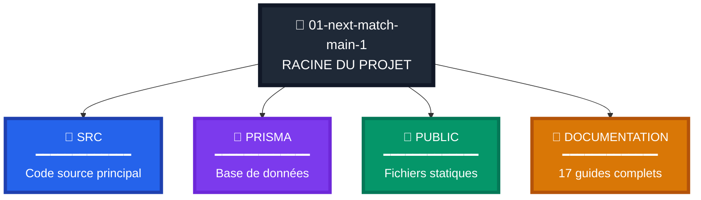

### Dossier src/

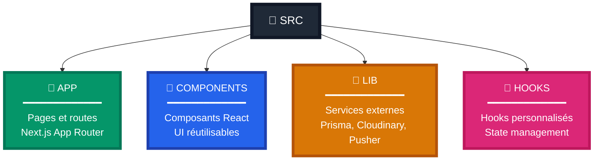

### Fichiers Configuration Racine

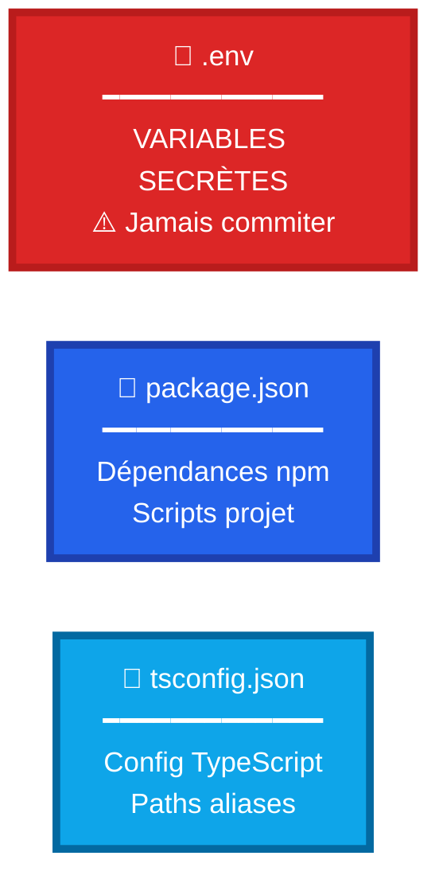

---

## Dossier src/app - Routes et Pages

### Routes Authentification

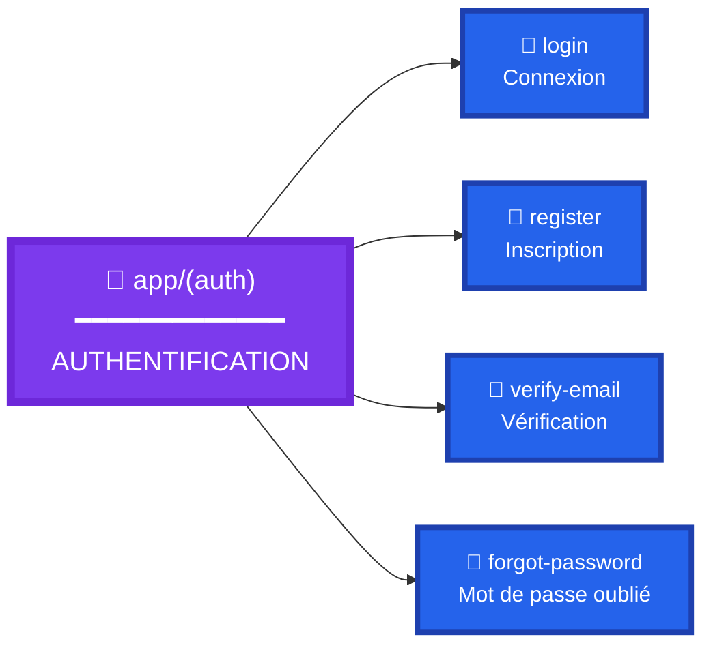

### Routes Membres

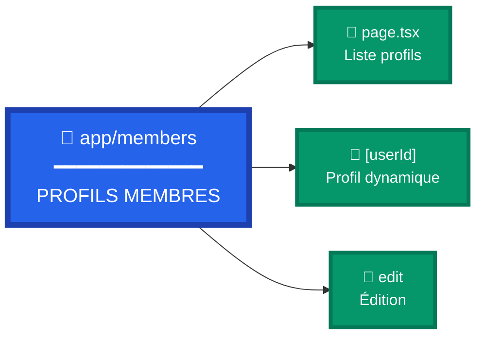

### Server Actions

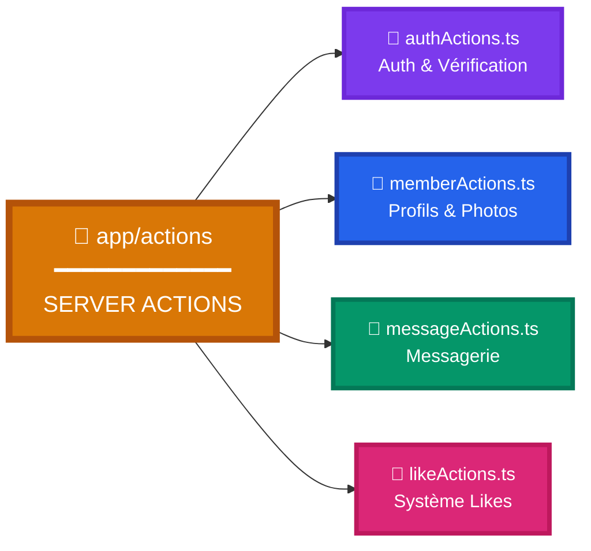

### API Routes

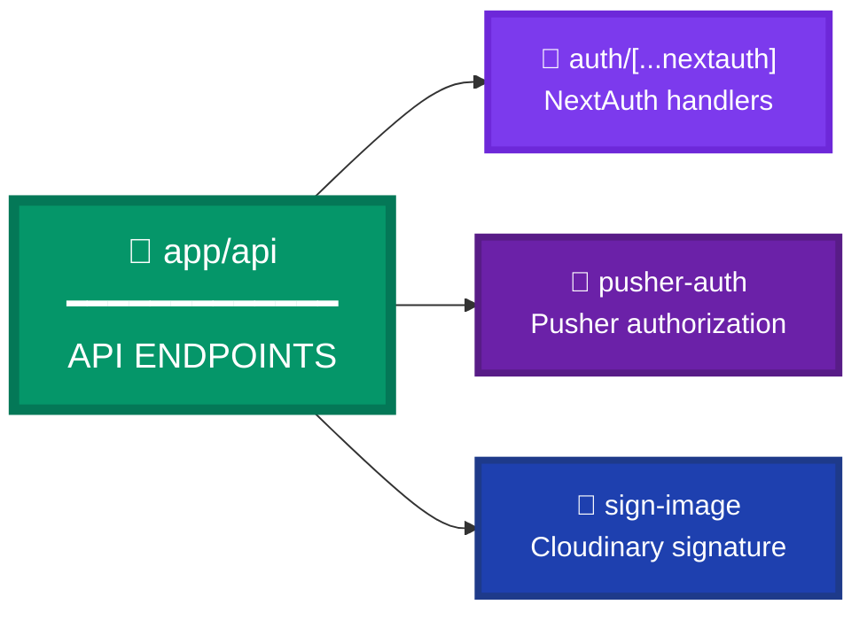

---

### Fichiers Importants de src/app

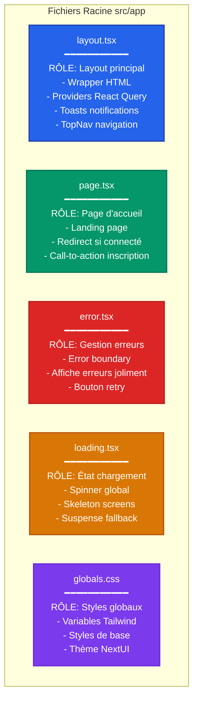

---

### Actions (Server Actions)

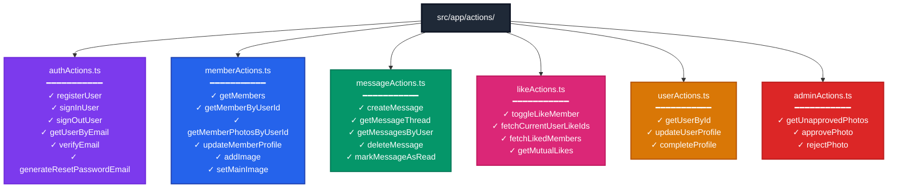

---

## Dossier src/lib - Bibliothèques et Utilitaires

### Structure et Rôles

### Services Externes (src/lib/)

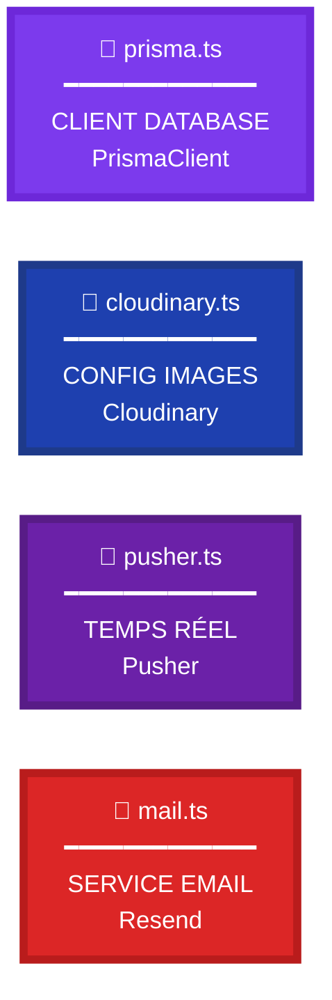

### Validation Zod (src/lib/schemas/)

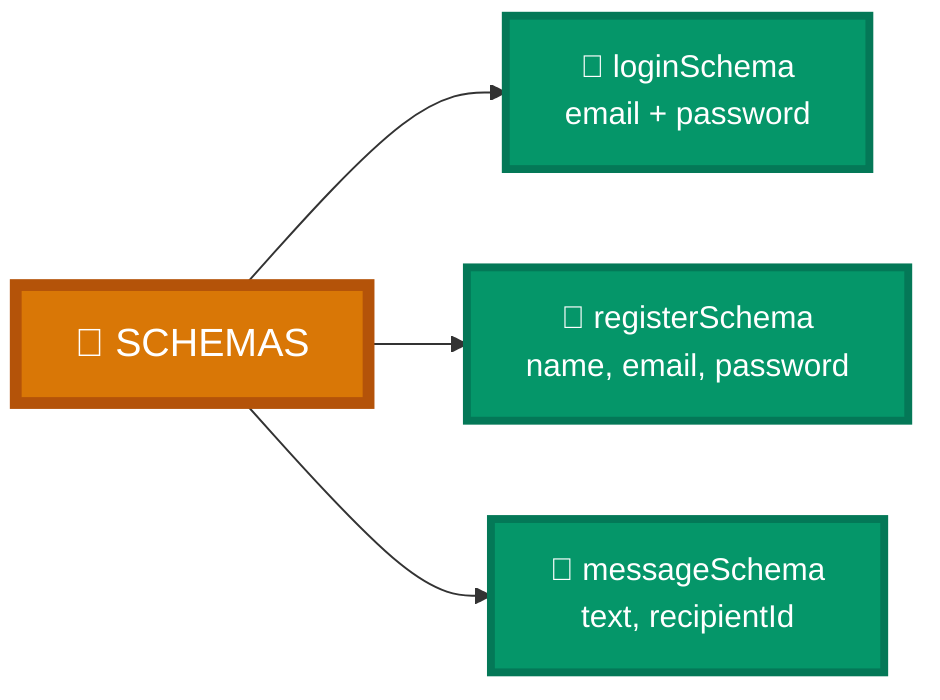

---

## Fichiers Critiques - Authentification

### auth.ts et auth.config.ts

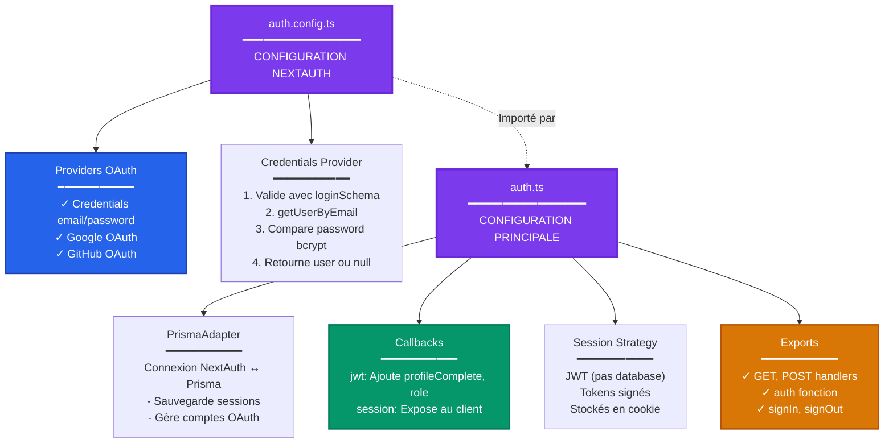

---

## Fichier middleware.ts

### Rôle et Flux

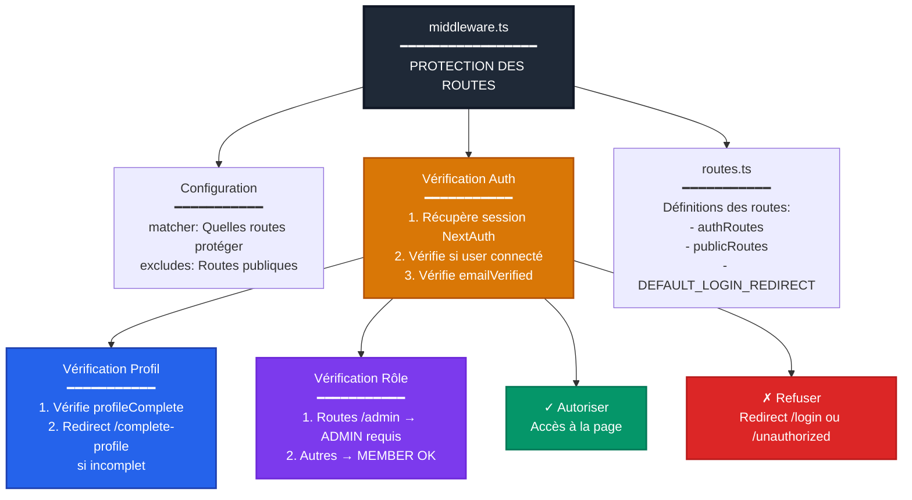

---

## Dossier src/components - Composants UI

### Composants Images

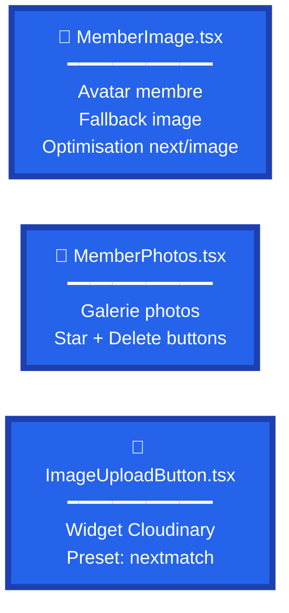

### Composants Boutons

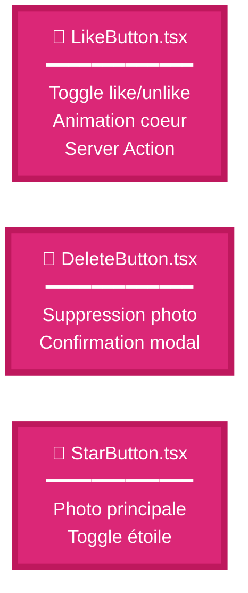

### Composants Navigation

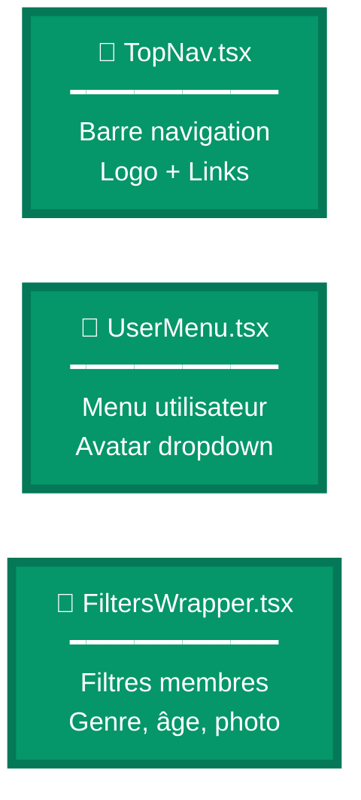

---

## Dossier src/hooks - Hooks Personnalisés

### Hooks Messagerie

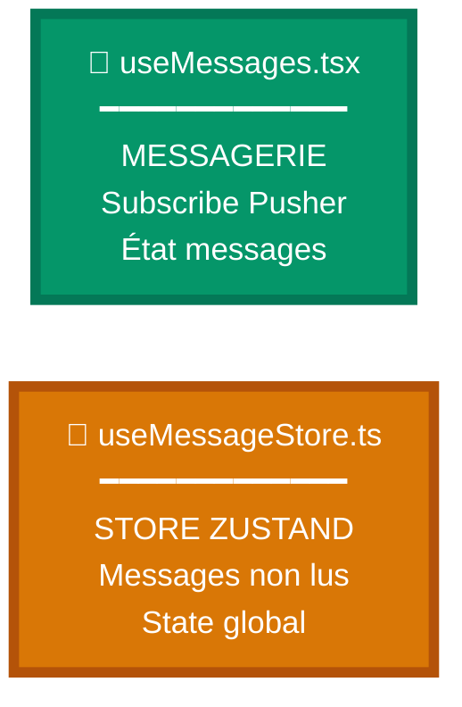

### Hooks Présence

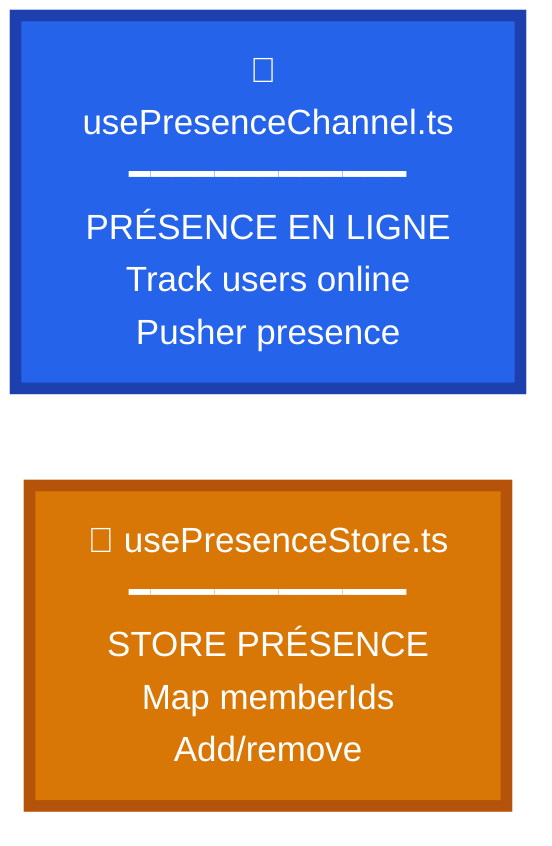

### Hooks Filtres

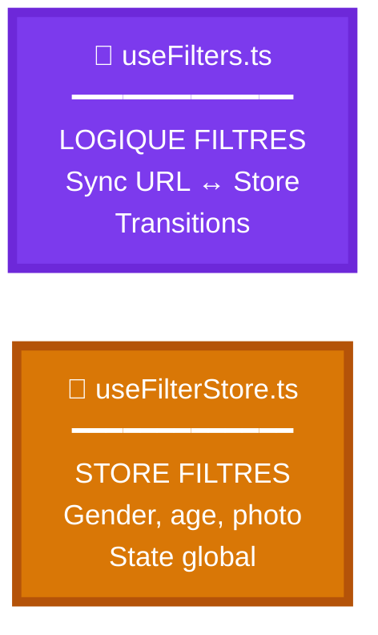

### Hook Notifications

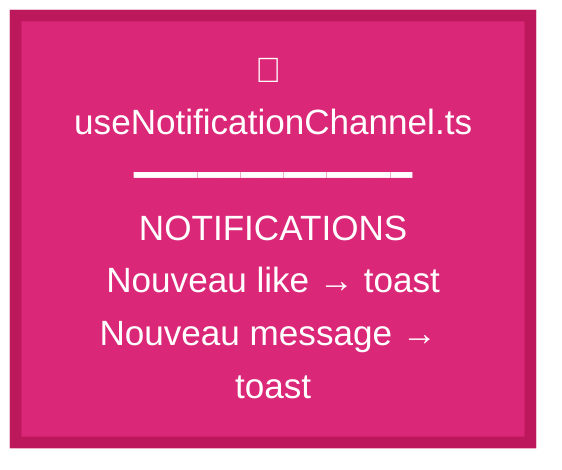

---

## Dossier prisma - Base de Données

### Structure Prisma

```mermaid
flowchart TD
    PRISMA["prisma/"]
    
    PRISMA --> SCHEMA["schema.prisma<br/>━━━━━━━━━━━━━━━━━<br/>SCHÉMA BASE DE DONNÉES<br/>━━━━━━━━━━━<br/>✓ Models: User, Member, Photo<br/>✓ Like, Message, Token, Account<br/>✓ Relations entre tables<br/>✓ Enums: Role, TokenType<br/>✓ Indexes et contraintes"]
    
    PRISMA --> SEED["seed.ts<br/>━━━━━━━━━━━━━━━━━<br/>PEUPLEMENT BASE<br/>━━━━━━━━━━━<br/>✓ Crée 10 profils test<br/>✓ 5 femmes + 5 hommes<br/>✓ 1 admin<br/>✓ Photos pour chacun<br/>✓ Password: 'password'"]
    
    PRISMA --> MEMBERS_DATA["membersData.ts<br/>━━━━━━━━━━━━━━━━━<br/>DONNÉES DE TEST<br/>━━━━━━━━━━━<br/>✓ Array de 10 profils<br/>✓ lisa, karen, margo...<br/>✓ todd, porter, mayo...<br/>✓ Infos: nom, age, ville"]
    
    PRISMA --> MIGRATIONS["migrations/<br/>━━━━━━━━━━━━━━━━━<br/>HISTORIQUE MIGRATIONS<br/>━━━━━━━━━━━<br/>✓ 20240413085447_initial<br/>✓ 20240413100752_added_is_approved<br/>✓ SQL de chaque migration"]
    
    SCHEMA --> MODELS["7 Models Prisma<br/>━━━━━━━━━━━"]
    
    MODELS --> USER_M["User<br/>Auth et base"]
    MODELS --> MEMBER_M["Member<br/>Profil public"]
    MODELS --> PHOTO_M["Photo<br/>Images"]
    MODELS --> LIKE_M["Like<br/>Relations"]
    MODELS --> MESSAGE_M["Message<br/>Messagerie"]
    MODELS --> TOKEN_M["Token<br/>Vérifications"]
    MODELS --> ACCOUNT_M["Account<br/>OAuth"]
    
    style PRISMA fill:#1f2937,stroke:#111827,stroke-width:3px,color:#fff
    style SCHEMA fill:#7c3aed,stroke:#6d28d9,stroke-width:3px,color:#fff
    style SEED fill:#059669,stroke:#047857,stroke-width:2px,color:#fff
    style MIGRATIONS fill:#2563eb,stroke:#1e40af,stroke-width:2px,color:#fff
    style MODELS fill:#d97706,stroke:#b45309,stroke-width:2px,color:#fff
```

---

## Fichiers de Configuration Racine

### Configuration du Projet

```mermaid
flowchart TD
    ROOT["Racine du projet"]
    
    ROOT --> ENV[".env<br/>━━━━━━━━━━━━━━━━━<br/>VARIABLES D'ENVIRONNEMENT<br/>━━━━━━━━━━━<br/>✓ DATABASE_URL<br/>✓ AUTH_SECRET<br/>✓ CLOUDINARY credentials<br/>✓ PUSHER credentials<br/>✓ RESEND_API_KEY<br/>⚠️ JAMAIS commiter !"]
    
    ROOT --> PACKAGE["package.json<br/>━━━━━━━━━━━━━━━━━<br/>DÉPENDANCES ET SCRIPTS<br/>━━━━━━━━━━━<br/>✓ dependencies: React, Next, Prisma<br/>✓ devDependencies: TypeScript, ESLint<br/>✓ scripts: dev, build, start<br/>✓ prisma seed config"]
    
    ROOT --> TSCONFIG["tsconfig.json<br/>━━━━━━━━━━━━━━━━━<br/>CONFIG TYPESCRIPT<br/>━━━━━━━━━━━<br/>✓ strict: true<br/>✓ paths aliases @ pour src/<br/>✓ target: ES2017<br/>✓ module: esnext"]
    
    ROOT --> NEXT_CONFIG["next.config.mjs<br/>━━━━━━━━━━━━━━━━━<br/>CONFIG NEXT.JS<br/>━━━━━━━━━━━<br/>✓ images: domains Cloudinary<br/>✓ experimental: staleTimes<br/>✓ env variables"]
    
    ROOT --> TAILWIND["tailwind.config.ts<br/>━━━━━━━━━━━━━━━━━<br/>CONFIG TAILWIND<br/>━━━━━━━━━━━<br/>✓ content paths<br/>✓ theme customization<br/>✓ plugins: NextUI"]
    
    ROOT --> POSTCSS["postcss.config.js<br/>━━━━━━━━━━━━━━━━━<br/>CONFIG CSS<br/>━━━━━━━━━━━<br/>✓ Tailwind plugin<br/>✓ Autoprefixer"]
    
    ROOT --> DOCKER["docker-compose.yml<br/>━━━━━━━━━━━━━━━━━<br/>CONFIG DOCKER<br/>━━━━━━━━━━━<br/>✓ Service PostgreSQL<br/>✓ Port 5432<br/>✓ Password: postgrespw"]
    
    style ROOT fill:#1f2937,stroke:#111827,stroke-width:3px,color:#fff
    style ENV fill:#dc2626,stroke:#b91c1c,stroke-width:3px,color:#fff
    style PACKAGE fill:#2563eb,stroke:#1e40af,stroke-width:2px,color:#fff
    style TSCONFIG fill:#0ea5e9,stroke:#0369a1,stroke-width:2px,color:#fff
    style NEXT_CONFIG fill:#1f2937,stroke:#111827,stroke-width:2px,color:#fff
    style TAILWIND fill:#0ea5e9,stroke:#0369a1,stroke-width:2px,color:#fff
```

---

## Flux de Dépendances - Fichiers Critiques

### Comment les Fichiers Interagissent

```mermaid
flowchart TD
    PAGE["Page Component<br/>src/app/membres/page.tsx"]
    
    PAGE --> ACTION["Server Action<br/>getMem bers"]
    
    ACTION --> PRISMA["prisma.ts<br/>Client DB"]
    
    PRISMA --> DB[("Base de Données<br/>Neon/Supabase")]
    
    ACTION --> MAPPINGS["mappings.ts<br/>Transform data"]
    
    MAPPINGS --> RETURN["Return to Page"]
    
    PAGE --> CARD["MemberCard.tsx<br/>Component"]
    
    CARD --> IMG["MemberImage.tsx"]
    CARD --> LIKE["LikeButton.tsx"]
    
    LIKE --> LIKE_ACTION["Server Action<br/>toggleLikeMember"]
    
    LIKE_ACTION --> PRISMA
    
    IMG --> PRESENCE["PresenceAvatar.tsx"]
    
    PRESENCE --> PRESENCE_HOOK["usePresenceChannel<br/>Hook"]
    
    PRESENCE_HOOK --> PRESENCE_STORE["usePresenceStore<br/>Zustand"]
    
    PRESENCE_HOOK --> PUSHER["pusher.ts<br/>Client"]
    
    PUSHER --> PUSHER_SERVICE["Pusher Service<br/>WebSocket"]
    
    style PAGE fill:#059669,stroke:#047857,stroke-width:2px,color:#fff
    style ACTION fill:#d97706,stroke:#b45309,stroke-width:2px,color:#fff
    style PRISMA fill:#7c3aed,stroke:#6d28d9,stroke-width:2px,color:#fff
    style DB fill:#2563eb,stroke:#1e40af,stroke-width:2px,color:#fff
    style CARD fill:#2563eb,stroke:#1e40af,stroke-width:2px,color:#fff
    style LIKE_ACTION fill:#d97706,stroke:#b45309,stroke-width:2px,color:#fff
    style PRESENCE_STORE fill:#d97706,stroke:#b45309,stroke-width:2px,color:#fff
    style PUSHER fill:#6b21a8,stroke:#581c87,stroke-width:2px,color:#fff
```

---

## Arborescence Complète avec Rôles

### SUPPRIMÉ - Trop complexe

**Utilisez plutôt les diagrammes simplifiés ci-dessus :**
- Architecture Globale (Vue Racine)
- Dossier src/
- Routes Authentification
- Routes Membres
- Server Actions
- Services Externes

---

## Fichiers par Fonctionnalité

### Feature: Authentification

#### Configuration Auth

```mermaid
flowchart TD
    AUTH_CFG["📄 auth.config.ts<br/>━━━━━━━━━━━━━<br/>PROVIDERS OAUTH<br/>Credentials, Google, GitHub"]
    AUTH_MAIN["📄 auth.ts<br/>━━━━━━━━━━━━━<br/>CONFIG NEXTAUTH<br/>Callbacks, Adapter, Session"]
    MIDDLE["📄 middleware.ts<br/>━━━━━━━━━━━━━<br/>PROTECTION ROUTES<br/>Session, Profil, Rôle"]
    
    style AUTH_CFG fill:#7c3aed,stroke:#6d28d9,stroke-width:6px,color:#fff,font-size:18px
    style AUTH_MAIN fill:#7c3aed,stroke:#6d28d9,stroke-width:6px,color:#fff,font-size:18px
    style MIDDLE fill:#dc2626,stroke:#b91c1c,stroke-width:6px,color:#fff,font-size:18px
```

#### Actions et Pages Auth

```mermaid
flowchart TD
    ACTIONS_A["📄 authActions.ts<br/>━━━━━━━━━━━━━<br/>SERVER ACTIONS<br/>register, login, verify, reset"]
    LOGIN_P["📁 app/auth/login<br/>━━━━━━━━━━━━━<br/>PAGE LOGIN<br/>LoginForm + SocialLogin"]
    REGISTER_P["📁 app/auth/register<br/>━━━━━━━━━━━━━<br/>PAGE REGISTER<br/>RegisterForm + Details"]
    
    style ACTIONS_A fill:#d97706,stroke:#b45309,stroke-width:6px,color:#fff,font-size:18px
    style LOGIN_P fill:#2563eb,stroke:#1e40af,stroke-width:6px,color:#fff,font-size:18px
    style REGISTER_P fill:#2563eb,stroke:#1e40af,stroke-width:6px,color:#fff,font-size:18px
```

---

### Feature: Messagerie Temps Réel

#### Service et Actions

```mermaid
flowchart TD
    PUSHER_L["📄 lib/pusher.ts<br/>━━━━━━━━━━━━━<br/>PUSHER CLIENT/SERVER<br/>Cluster: mt1<br/>Private channels"]
    MSG_ACT["📄 actions/messageActions.ts<br/>━━━━━━━━━━━━━<br/>CREATE MESSAGE<br/>Prisma + Pusher trigger"]
    API_PUSHER["📄 api/pusher-auth<br/>━━━━━━━━━━━━━<br/>AUTHORIZE PUSHER<br/>Private channels auth"]
    
    style PUSHER_L fill:#6b21a8,stroke:#581c87,stroke-width:6px,color:#fff,font-size:18px
    style MSG_ACT fill:#d97706,stroke:#b45309,stroke-width:6px,color:#fff,font-size:18px
    style API_PUSHER fill:#059669,stroke:#047857,stroke-width:6px,color:#fff,font-size:18px
```

#### Hooks Messagerie

```mermaid
flowchart TD
    HOOK_MSG["📄 useMessages.tsx<br/>━━━━━━━━━━━━━<br/>HOOK MESSAGERIE<br/>Subscribe Pusher<br/>État local"]
    STORE_MSG["📄 useMessageStore.ts<br/>━━━━━━━━━━━━━<br/>STORE ZUSTAND<br/>Messages non lus<br/>State global"]
    
    style HOOK_MSG fill:#059669,stroke:#047857,stroke-width:6px,color:#fff,font-size:18px
    style STORE_MSG fill:#d97706,stroke:#b45309,stroke-width:6px,color:#fff,font-size:18px
```

#### Pages Chat

```mermaid
flowchart TD
    CHAT["📁 members/[userId]/chat<br/>━━━━━━━━━━━━━<br/>CHAT 1-to-1<br/>ChatForm + MessageList"]
    MESSAGES_P["📁 messages<br/>━━━━━━━━━━━━━<br/>LISTE CONVERSATIONS<br/>MessageTable"]
    
    style CHAT fill:#2563eb,stroke:#1e40af,stroke-width:6px,color:#fff,font-size:18px
    style MESSAGES_P fill:#2563eb,stroke:#1e40af,stroke-width:6px,color:#fff,font-size:18px
```

---

### Feature: Upload et Modération Photos

#### Service Cloudinary

```mermaid
flowchart TD
    CLOUD["📄 lib/cloudinary.ts<br/>━━━━━━━━━━━━━<br/>CONFIG CLOUDINARY<br/>cloud_name, api_key, secret"]
    SIGN["📄 api/sign-image<br/>━━━━━━━━━━━━━<br/>SIGNATURE CLOUDINARY<br/>Pour mode Signed"]
    
    style CLOUD fill:#1e40af,stroke:#1e3a8a,stroke-width:6px,color:#fff,font-size:18px
    style SIGN fill:#059669,stroke:#047857,stroke-width:6px,color:#fff,font-size:18px
```

#### Composants Upload

```mermaid
flowchart TD
    UPLOAD["📄 ImageUploadButton.tsx<br/>━━━━━━━━━━━━━<br/>WIDGET UPLOAD<br/>Preset: nextmatch<br/>Cloudinary"]
    GALLERY["📄 MemberPhotos.tsx<br/>━━━━━━━━━━━━━<br/>GALERIE PHOTOS<br/>Star + Delete<br/>Awaiting approval"]
    
    style UPLOAD fill:#2563eb,stroke:#1e40af,stroke-width:6px,color:#fff,font-size:18px
    style GALLERY fill:#2563eb,stroke:#1e40af,stroke-width:6px,color:#fff,font-size:18px
```

#### Actions Photos

```mermaid
flowchart TD
    MEMBER_ACT["📄 memberActions.ts<br/>━━━━━━━━━━━━━<br/>ACTIONS MEMBRE<br/>addImage, setMain, delete<br/>isApproved: false"]
    ADMIN_ACT["📄 adminActions.ts<br/>━━━━━━━━━━━━━<br/>ACTIONS ADMIN<br/>approvePhoto, rejectPhoto<br/>Modération"]
    
    style MEMBER_ACT fill:#d97706,stroke:#b45309,stroke-width:6px,color:#fff,font-size:18px
    style ADMIN_ACT fill:#dc2626,stroke:#b91c1c,stroke-width:6px,color:#fff,font-size:18px
```

---

### Feature: Système de Likes

#### Composant et Actions

```mermaid
flowchart TD
    LIKE_BTN["📄 LikeButton.tsx<br/>━━━━━━━━━━━━━<br/>BOUTON LIKE<br/>Coeur animation<br/>Optimistic update"]
    LIKE_ACT["📄 likeActions.ts<br/>━━━━━━━━━━━━━<br/>SERVER ACTION<br/>toggleLikeMember<br/>Check match mutuel"]
    LISTS["📁 app/lists<br/>━━━━━━━━━━━━━<br/>PAGE LISTES<br/>Liked, Liked by, Mutual"]
    
    style LIKE_BTN fill:#db2777,stroke:#be185d,stroke-width:6px,color:#fff,font-size:18px
    style LIKE_ACT fill:#d97706,stroke:#b45309,stroke-width:6px,color:#fff,font-size:18px
    style LISTS fill:#2563eb,stroke:#1e40af,stroke-width:6px,color:#fff,font-size:18px
```

---

## Fichiers les Plus Importants

### Configuration (4 fichiers critiques)

```mermaid
flowchart TD
    ENV["📄 .env<br/>━━━━━━━━━━━━━<br/>VARIABLES SECRÈTES<br/>DATABASE_URL, API Keys"]
    AUTH["📄 auth.ts<br/>━━━━━━━━━━━━━<br/>CONFIG NEXTAUTH<br/>Session, Callbacks"]
    MIDDLEWARE["📄 middleware.ts<br/>━━━━━━━━━━━━━<br/>PROTECTION ROUTES<br/>Auth, Role check"]
    SCHEMA["📄 schema.prisma<br/>━━━━━━━━━━━━━<br/>SCHÉMA BDD<br/>7 Models"]
    
    style ENV fill:#dc2626,stroke:#b91c1c,stroke-width:6px,color:#fff,font-size:18px
    style AUTH fill:#7c3aed,stroke:#6d28d9,stroke-width:6px,color:#fff,font-size:18px
    style MIDDLEWARE fill:#dc2626,stroke:#b91c1c,stroke-width:6px,color:#fff,font-size:18px
    style SCHEMA fill:#7c3aed,stroke:#6d28d9,stroke-width:6px,color:#fff,font-size:18px
```

### Bibliothèques (4 services)

```mermaid
flowchart LR
    PRISMA_L["📄 lib/prisma.ts<br/>━━━━━━━━━━━━━<br/>CLIENT DATABASE"]
    PUSHER_L["📄 lib/pusher.ts<br/>━━━━━━━━━━━━━<br/>TEMPS RÉEL"]
    CLOUD_L["📄 lib/cloudinary.ts<br/>━━━━━━━━━━━━━<br/>IMAGES"]
    MAIL_L["📄 lib/mail.ts<br/>━━━━━━━━━━━━━<br/>EMAILS"]
    
    style PRISMA_L fill:#7c3aed,stroke:#6d28d9,stroke-width:6px,color:#fff,font-size:18px
    style PUSHER_L fill:#6b21a8,stroke:#581c87,stroke-width:6px,color:#fff,font-size:18px
    style CLOUD_L fill:#1e40af,stroke:#1e3a8a,stroke-width:6px,color:#fff,font-size:18px
    style MAIL_L fill:#dc2626,stroke:#b91c1c,stroke-width:6px,color:#fff,font-size:18px
```

### Server Actions (4 actions principales)

```mermaid
flowchart LR
    AUTH_ACT["📄 authActions.ts<br/>━━━━━━━━━━━━━<br/>AUTH"]
    MEMBER_ACT["📄 memberActions.ts<br/>━━━━━━━━━━━━━<br/>PROFILS"]
    MSG_ACT["📄 messageActions.ts<br/>━━━━━━━━━━━━━<br/>MESSAGES"]
    LIKE_ACT["📄 likeActions.ts<br/>━━━━━━━━━━━━━<br/>LIKES"]
    
    style AUTH_ACT fill:#d97706,stroke:#b45309,stroke-width:6px,color:#fff,font-size:18px
    style MEMBER_ACT fill:#d97706,stroke:#b45309,stroke-width:6px,color:#fff,font-size:18px
    style MSG_ACT fill:#d97706,stroke:#b45309,stroke-width:6px,color:#fff,font-size:18px
    style LIKE_ACT fill:#d97706,stroke:#b45309,stroke-width:6px,color:#fff,font-size:18px
```

---

## Résumé - Organisation du Code

### Principe de Séparation

```mermaid
flowchart LR
    USER["Utilisateur"]
    
    USER --> UI["📁 components<br/>Interface utilisateur<br/>React Client Components"]
    
    UI --> HOOKS["📁 hooks<br/>Logique réutilisable<br/>State management"]
    
    HOOKS --> ACTIONS["📁 actions<br/>Server Actions<br/>Logique métier serveur"]
    
    ACTIONS --> LIB["📁 lib<br/>Services externes<br/>Prisma, Pusher, Cloudinary"]
    
    LIB --> SERVICES["Services Externes<br/>━━━━━━━━━━━<br/>Database<br/>WebSocket<br/>Storage<br/>Email"]
    
    ACTIONS --> SCHEMAS["📁 schemas<br/>Validation Zod<br/>Type safety"]
    
    style USER fill:#1f2937,stroke:#111827,stroke-width:2px,color:#fff
    style UI fill:#2563eb,stroke:#1e40af,stroke-width:2px,color:#fff
    style HOOKS fill:#059669,stroke:#047857,stroke-width:2px,color:#fff
    style ACTIONS fill:#d97706,stroke:#b45309,stroke-width:2px,color:#fff
    style LIB fill:#7c3aed,stroke:#6d28d9,stroke-width:2px,color:#fff
    style SERVICES fill:#db2777,stroke:#be185d,stroke-width:2px,color:#fff
    style SCHEMAS fill:#059669,stroke:#047857,stroke-width:2px,color:#fff
```

---

**Documentation complète avec 17 guides incluant l'arborescence détaillée !**

