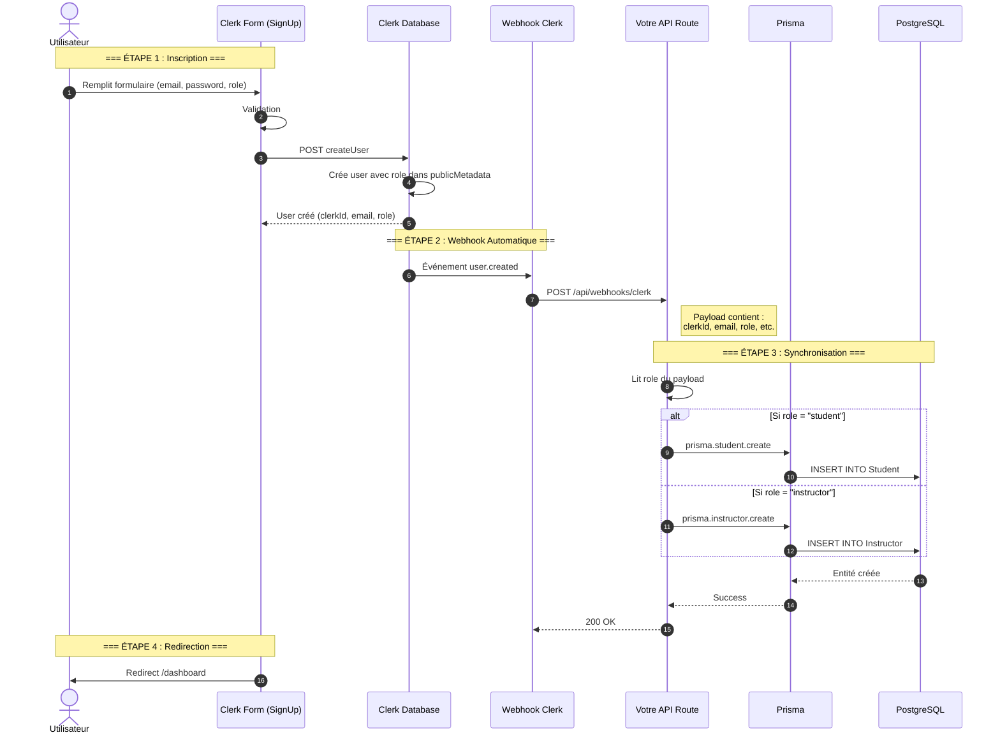

# Architecture Clerk : Synchronisation avec Prisma

Ce document explique **EXACTEMENT** comment fonctionne l'architecture avec Clerk et comment synchroniser les utilisateurs Clerk avec PostgreSQL/Prisma.

---

## 🎯 Votre Question Principale

> "Quand un utilisateur s'enregistre avec Clerk, il est créé dans le dashboard Clerk MAIS PAS dans Prisma. Comment faire la liaison ?"

**Réponse : Les WEBHOOKS !**

---

## Architecture Complète avec Clerk

### Flux de Données



**Point clé : Vous N'AVEZ PAS besoin de table User dans Prisma ! Clerk est votre "table User".**

---

## Question 1 : Comment Faire le POST des Users avec Clerk ?

### Avec NextAuth (Actuel)

```typescript
// Client appelle Server Action
const result = await registerUser({
  email: "john@example.com",
  password: "password123",
  role: "student"
})

// Server Action
export async function registerUser(data) {
  // Hash password
  const hash = await bcrypt.hash(data.password, 10)
  
  // Créer dans PostgreSQL
  const user = await prisma.user.create({
    data: {
      email: data.email,
      passwordHash: hash,
      role: data.role
    }
  })
  
  // VOUS gérez TOUT manuellement
}
```

---

### Avec Clerk

**Vous N'ÉCRIVEZ PAS de code pour créer le user !**

Clerk le fait automatiquement, MAIS vous pouvez passer des données custom (le rôle) :

#### Méthode 1 : Formulaire Clerk avec Metadata

```typescript
// app/sign-up/page.tsx
import { SignUp } from '@clerk/nextjs'

export default function SignUpPage() {
  return (
    <SignUp 
      routing="path"
      path="/sign-up"
      appearance={{
        elements: {
          formButtonPrimary: 'bg-blue-500'
        }
      }}
      // Pas de champ role ici, on le demandera après
    />
  )
}
```

**Après inscription, rediriger vers formulaire de sélection rôle :**

```typescript
// app/complete-signup/page.tsx
'use client'
import { useUser } from '@clerk/nextjs'
import { useState } from 'react'

export default function CompleteSignupPage() {
  const { user } = useUser()
  const [role, setRole] = useState('')

  const handleSubmit = async (e) => {
    e.preventDefault()
    
    // Mettre à jour les metadata Clerk avec le rôle
    await user.update({
      publicMetadata: {
        role: role, // "student" ou "instructor"
        onboardingComplete: true
      }
    })
    
    // Trigger création dans Prisma via webhook
    // Le webhook user.updated sera appelé automatiquement
    
    window.location.href = '/dashboard'
  }

  return (
    <form onSubmit={handleSubmit}>
      <h1>Choisissez votre rôle</h1>
      <select value={role} onChange={e => setRole(e.target.value)}>
        <option value="">Sélectionner...</option>
        <option value="student">Étudiant</option>
        <option value="instructor">Instructeur</option>
      </select>
      <button type="submit">Continuer</button>
    </form>
  )
}
```

---

#### Méthode 2 : Formulaire Custom avec Clerk API

```typescript
'use client'
import { useSignUp } from '@clerk/nextjs'
import { useState } from 'react'

export default function CustomSignUpForm() {
  const { signUp, setActive } = useSignUp()
  const [formData, setFormData] = useState({
    email: '',
    password: '',
    firstName: '',
    lastName: '',
    role: 'student' // ← Notre champ custom
  })

  const handleSubmit = async (e) => {
    e.preventDefault()
    
    try {
      // Créer user avec metadata
      const result = await signUp.create({
        emailAddress: formData.email,
        password: formData.password,
        firstName: formData.firstName,
        lastName: formData.lastName,
        
        // ← IMPORTANT : Passer le rôle dans publicMetadata
        unsafeMetadata: {
          role: formData.role
        }
      })
      
      // Envoyer code vérification
      await signUp.prepareEmailAddressVerification({
        strategy: 'email_code'
      })
      
      // Rediriger vers page vérification
      router.push('/verify-email')
      
    } catch (err) {
      console.error(err)
    }
  }

  return (
    <form onSubmit={handleSubmit}>
      <input 
        type="email"
        value={formData.email}
        onChange={e => setFormData({...formData, email: e.target.value})}
        placeholder="Email"
      />
      
      <input 
        type="password"
        value={formData.password}
        onChange={e => setFormData({...formData, password: e.target.value})}
        placeholder="Password"
      />
      
      <input 
        value={formData.firstName}
        onChange={e => setFormData({...formData, firstName: e.target.value})}
        placeholder="Prénom"
      />
      
      <input 
        value={formData.lastName}
        onChange={e => setFormData({...formData, lastName: e.target.value})}
        placeholder="Nom"
      />
      
      {/* ← Notre champ custom */}
      <select 
        value={formData.role}
        onChange={e => setFormData({...formData, role: e.target.value})}
      >
        <option value="student">Étudiant</option>
        <option value="instructor">Instructeur</option>
      </select>
      
      <button type="submit">S'inscrire</button>
    </form>
  )
}
```

**Point clé : Le rôle est stocké dans `unsafeMetadata` chez Clerk, et sera envoyé dans le webhook !**

---

## Question 2 : Comment Passer les Users de Clerk à PostgreSQL ?

### La Solution : WEBHOOKS

**Clerk envoie automatiquement un webhook à votre API quand un événement se produit.**

### Configuration

#### Étape 1 : Créer la Route API Webhook

**Fichier : `app/api/webhooks/clerk/route.ts`**

```typescript
import { Webhook } from 'svix'
import { headers } from 'next/headers'
import { prisma } from '@/lib/prisma'
import { WebhookEvent } from '@clerk/nextjs/server'

export async function POST(req: Request) {
  // Récupérer le secret webhook depuis .env
  const WEBHOOK_SECRET = process.env.CLERK_WEBHOOK_SECRET

  if (!WEBHOOK_SECRET) {
    throw new Error('CLERK_WEBHOOK_SECRET manquant')
  }

  // Récupérer headers pour vérification signature
  const headerPayload = headers()
  const svix_id = headerPayload.get('svix-id')
  const svix_timestamp = headerPayload.get('svix-timestamp')
  const svix_signature = headerPayload.get('svix-signature')

  if (!svix_id || !svix_timestamp || !svix_signature) {
    return new Response('Missing svix headers', { status: 400 })
  }

  // Récupérer le body
  const payload = await req.json()
  const body = JSON.stringify(payload)

  // Créer instance Svix pour vérifier signature
  const wh = new Webhook(WEBHOOK_SECRET)

  let evt: WebhookEvent

  try {
    // Vérifier que le webhook vient bien de Clerk
    evt = wh.verify(body, {
      'svix-id': svix_id,
      'svix-timestamp': svix_timestamp,
      'svix-signature': svix_signature,
    }) as WebhookEvent
  } catch (err) {
    console.error('Erreur vérification webhook:', err)
    return new Response('Signature invalide', { status: 400 })
  }

  // ═══════════════════════════════════════════════════════
  // TRAITEMENT DES ÉVÉNEMENTS
  // ═══════════════════════════════════════════════════════

  const eventType = evt.type

  // ───────────────────────────────────────────────────────
  // ÉVÉNEMENT : user.created (Nouvel utilisateur)
  // ───────────────────────────────────────────────────────
  if (eventType === 'user.created') {
    const { id, email_addresses, first_name, last_name, image_url, unsafe_metadata } = evt.data

    const email = email_addresses[0]?.email_address
    const clerkId = id
    
    // ← RÉCUPÉRER LE RÔLE depuis metadata
    const role = unsafe_metadata?.role as string || 'student'

    console.log('Nouvel utilisateur créé:', {
      clerkId,
      email,
      role
    })

    // Créer l'entité correspondante selon le rôle
    if (role === 'student') {
      await prisma.student.create({
        data: {
          clerkId: clerkId,
          email: email,
          firstName: first_name || '',
          lastName: last_name || '',
          imageUrl: image_url || null,
        }
      })
      
      console.log('✅ Student créé dans Prisma')
    } 
    else if (role === 'instructor') {
      await prisma.instructor.create({
        data: {
          clerkId: clerkId,
          email: email,
          firstName: first_name || '',
          lastName: last_name || '',
          imageUrl: image_url || null,
          bio: '', // Valeurs par défaut
        }
      })
      
      console.log('✅ Instructor créé dans Prisma')
    }
  }

  // ───────────────────────────────────────────────────────
  // ÉVÉNEMENT : user.updated (Utilisateur mis à jour)
  // ───────────────────────────────────────────────────────
  if (eventType === 'user.updated') {
    const { id, email_addresses, first_name, last_name, image_url, public_metadata } = evt.data

    const email = email_addresses[0]?.email_address
    const clerkId = id
    const role = public_metadata?.role as string

    console.log('Utilisateur mis à jour:', { clerkId, role })

    // Si rôle vient d'être ajouté (onboarding complete)
    if (role && !await doesUserExistInDB(clerkId)) {
      // Créer l'entité comme dans user.created
      if (role === 'student') {
        await prisma.student.create({
          data: {
            clerkId: clerkId,
            email: email,
            firstName: first_name || '',
            lastName: last_name || '',
            imageUrl: image_url || null,
          }
        })
        console.log('✅ Student créé lors de user.updated')
      }
      else if (role === 'instructor') {
        await prisma.instructor.create({
          data: {
            clerkId: clerkId,
            email: email,
            firstName: first_name || '',
            lastName: last_name || '',
            imageUrl: image_url || null,
            bio: '',
          }
        })
        console.log('✅ Instructor créé lors de user.updated')
      }
    } else {
      // Mettre à jour l'entité existante
      if (role === 'student') {
        await prisma.student.update({
          where: { clerkId: clerkId },
          data: {
            email: email,
            firstName: first_name || undefined,
            lastName: last_name || undefined,
            imageUrl: image_url || undefined,
          }
        })
      } else if (role === 'instructor') {
        await prisma.instructor.update({
          where: { clerkId: clerkId },
          data: {
            email: email,
            firstName: first_name || undefined,
            lastName: last_name || undefined,
            imageUrl: image_url || undefined,
          }
        })
      }
      console.log('✅ Entité mise à jour dans Prisma')
    }
  }

  // ───────────────────────────────────────────────────────
  // ÉVÉNEMENT : user.deleted (Utilisateur supprimé)
  // ───────────────────────────────────────────────────────
  if (eventType === 'user.deleted') {
    const { id } = evt.data
    const clerkId = id

    console.log('Utilisateur supprimé:', clerkId)

    // Supprimer de Prisma (cascade delete des relations)
    try {
      await prisma.student.delete({
        where: { clerkId: clerkId }
      })
      console.log('✅ Student supprimé')
    } catch {
      // Si n'existe pas comme student, essayer instructor
      try {
        await prisma.instructor.delete({
          where: { clerkId: clerkId }
        })
        console.log('✅ Instructor supprimé')
      } catch (err) {
        console.log('⚠️ Utilisateur non trouvé dans Prisma')
      }
    }
  }

  return new Response('Webhook traité', { status: 200 })
}

// Fonction helper
async function doesUserExistInDB(clerkId: string): Promise<boolean> {
  const student = await prisma.student.findUnique({
    where: { clerkId }
  })
  
  if (student) return true
  
  const instructor = await prisma.instructor.findUnique({
    where: { clerkId }
  })
  
  return !!instructor
}
```

---

#### Étape 2 : Configuration Clerk Dashboard

1. Allez sur https://dashboard.clerk.com
2. Configure > Webhooks
3. **Add Endpoint**
4. **Endpoint URL :** `https://votre-domaine.com/api/webhooks/clerk`
   - En dev : `https://votre-tunnel-ngrok.ngrok.io/api/webhooks/clerk`
5. **Subscribe to events :**
   - ✅ `user.created`
   - ✅ `user.updated`
   - ✅ `user.deleted`
6. **Create**
7. **Copier le Signing Secret** → `.env`

---

#### Étape 3 : Configuration `.env`

```env
# Clerk
NEXT_PUBLIC_CLERK_PUBLISHABLE_KEY="pk_test_..."
CLERK_SECRET_KEY="sk_test_..."

# ← IMPORTANT : Webhook Secret
CLERK_WEBHOOK_SECRET="whsec_..."

# Database
DATABASE_URL="postgresql://..."
```

---

#### Étape 4 : Installation Dépendances

```bash
npm install svix
```

---

#### Étape 5 : Schéma Prisma

```prisma
// PAS DE MODEL USER ! Clerk gère les users

model Student {
  id          String   @id @default(cuid())
  clerkId     String   @unique  // ← Lien vers Clerk
  email       String   @unique
  firstName   String
  lastName    String
  imageUrl    String?
  createdAt   DateTime @default(now())
  updatedAt   DateTime @updatedAt
  
  enrollments Enrollment[]
}

model Instructor {
  id          String   @id @default(cuid())
  clerkId     String   @unique  // ← Lien vers Clerk
  email       String   @unique
  firstName   String
  lastName    String
  imageUrl    String?
  bio         String
  createdAt   DateTime @default(now())
  updatedAt   DateTime @updatedAt
  
  courses     Course[]
}

model Course {
  id           String   @id @default(cuid())
  instructorId String
  instructor   Instructor @relation(fields: [instructorId], references: [id])
  title        String
  description  String
  
  enrollments  Enrollment[]
}

model Enrollment {
  id        String   @id @default(cuid())
  studentId String
  courseId  String
  student   Student @relation(fields: [studentId], references: [id])
  course    Course @relation(fields: [courseId], references: [id])
  
  @@unique([studentId, courseId])
}
```

**Point clé : `clerkId` est la foreign key vers Clerk !**

---

## Question 3 : Peut-on Ne PAS Avoir de Table User dans Prisma ?

### ✅ OUI ! C'est même RECOMMANDÉ avec Clerk

**Avec Clerk, vous N'AVEZ PAS BESOIN de table User dans Prisma.**

**Clerk = Votre "table User"**

### Architecture Recommandée

```
┌────────────────────────────────────────┐
│  CLERK DATABASE (Managed by Clerk)    │
│  ├─ Users                              │
│  │  ├─ id (clerkId)                   │
│  │  ├─ email                           │
│  │  ├─ password (hashed)              │
│  │  ├─ emailVerified                  │
│  │  ├─ imageUrl                       │
│  │  └─ publicMetadata { role }        │
│  │                                     │
│  ├─ Sessions                           │
│  └─ OAuth Accounts                     │
└────────────────────────────────────────┘
              ↓
         Webhooks
              ↓
┌────────────────────────────────────────┐
│  VOTRE DATABASE (PostgreSQL + Prisma) │
│  ├─ Student (clerkId FK)               │
│  ├─ Instructor (clerkId FK)            │
│  ├─ Course                             │
│  ├─ Enrollment                         │
│  └─ ... (business logic)               │
└────────────────────────────────────────┘
```

**Séparation des préoccupations :**
- **Clerk** : Authentication (users, passwords, sessions, 2FA, OAuth)
- **Prisma** : Business logic (students, courses, enrollments)

---

## Question 4 : Comment Gérer les Autorisations ?

### Avec Role dans Clerk Metadata

**Stocker le rôle dans `publicMetadata` :**

```typescript
// Lors de l'inscription ou après
await user.update({
  publicMetadata: {
    role: 'instructor' // ou 'student'
  }
})
```

**Vérifier le rôle dans votre code :**

#### Dans un Server Component

```typescript
import { currentUser } from '@clerk/nextjs'
import { redirect } from 'next/navigation'

export default async function InstructorDashboard() {
  const user = await currentUser()
  
  if (!user) {
    redirect('/sign-in')
  }
  
  // ← Vérifier le rôle
  const role = user.publicMetadata?.role as string
  
  if (role !== 'instructor') {
    return <div>Accès refusé. Réservé aux instructeurs.</div>
  }
  
  return <div>Dashboard Instructeur</div>
}
```

---

#### Dans une API Route

```typescript
import { currentUser } from '@clerk/nextjs'
import { NextResponse } from 'next/server'

export async function GET(req: Request) {
  const user = await currentUser()
  
  if (!user) {
    return NextResponse.json({ error: 'Unauthorized' }, { status: 401 })
  }
  
  const role = user.publicMetadata?.role as string
  
  if (role !== 'instructor') {
    return NextResponse.json({ error: 'Forbidden' }, { status: 403 })
  }
  
  // ← Code réservé aux instructeurs
  const courses = await prisma.course.findMany({
    where: {
      instructor: {
        clerkId: user.id
      }
    }
  })
  
  return NextResponse.json({ courses })
}
```

---

#### Dans le Middleware

```typescript
import { authMiddleware } from '@clerk/nextjs'
import { NextResponse } from 'next/server'

export default authMiddleware({
  publicRoutes: ['/'],
  
  afterAuth(auth, req) {
    // Si non connecté
    if (!auth.userId) {
      return NextResponse.redirect(new URL('/sign-in', req.url))
    }
    
    // ← Vérifier rôle pour routes spécifiques
    const role = auth.sessionClaims?.publicMetadata?.role as string
    
    // Routes instructeurs
    if (req.nextUrl.pathname.startsWith('/instructor')) {
      if (role !== 'instructor') {
        return NextResponse.redirect(new URL('/unauthorized', req.url))
      }
    }
    
    // Routes étudiants
    if (req.nextUrl.pathname.startsWith('/student')) {
      if (role !== 'student') {
        return NextResponse.redirect(new URL('/unauthorized', req.url))
      }
    }
  }
})

export const config = {
  matcher: ['/((?!.+\\.[\\w]+$|_next).*)', '/', '/(api|trpc)(.*)']
}
```

---

## Flux Complet : Inscription → Autorisation

### Étape par Étape

#### 1. Utilisateur S'inscrit

```typescript
// app/sign-up/page.tsx
import { SignUp } from '@clerk/nextjs'

export default function SignUpPage() {
  return <SignUp afterSignUpUrl="/choose-role" />
}
```

---

#### 2. Choisit son Rôle

```typescript
// app/choose-role/page.tsx
'use client'
import { useUser } from '@clerk/nextjs'
import { useRouter } from 'next/navigation'

export default function ChooseRolePage() {
  const { user } = useUser()
  const router = useRouter()

  const selectRole = async (role: 'student' | 'instructor') => {
    // Mettre à jour metadata Clerk
    await user.update({
      publicMetadata: { role }
    })
    
    // ← WEBHOOK user.updated sera appelé automatiquement
    // et créera Student ou Instructor dans Prisma
    
    // Rediriger selon le rôle
    if (role === 'student') {
      router.push('/student/dashboard')
    } else {
      router.push('/instructor/dashboard')
    }
  }

  return (
    <div>
      <h1>Choisissez votre rôle</h1>
      <button onClick={() => selectRole('student')}>
        Je suis étudiant
      </button>
      <button onClick={() => selectRole('instructor')}>
        Je suis instructeur
      </button>
    </div>
  )
}
```

---

#### 3. Webhook Crée l'Entité

```typescript
// app/api/webhooks/clerk/route.ts

// user.updated détecte le nouveau role
if (eventType === 'user.updated') {
  const role = public_metadata?.role
  
  if (role === 'student') {
    // Créer Student dans Prisma
    await prisma.student.create({
      data: {
        clerkId: id,
        email: email,
        firstName: first_name,
        lastName: last_name
      }
    })
  }
  else if (role === 'instructor') {
    // Créer Instructor dans Prisma
    await prisma.instructor.create({
      data: {
        clerkId: id,
        email: email,
        firstName: first_name,
        lastName: last_name,
        bio: ''
      }
    })
  }
}
```

---

#### 4. Utiliser les Données

```typescript
// app/student/courses/page.tsx
import { currentUser } from '@clerk/nextjs'
import { prisma } from '@/lib/prisma'

export default async function StudentCoursesPage() {
  const user = await currentUser()
  
  if (!user) redirect('/sign-in')
  
  // Récupérer le Student depuis Prisma avec clerkId
  const student = await prisma.student.findUnique({
    where: { clerkId: user.id },
    include: {
      enrollments: {
        include: {
          course: true
        }
      }
    }
  })
  
  if (!student) {
    return <div>Profil étudiant non trouvé</div>
  }
  
  return (
    <div>
      <h1>Mes Cours</h1>
      {student.enrollments.map(enrollment => (
        <div key={enrollment.id}>
          <h2>{enrollment.course.title}</h2>
        </div>
      ))}
    </div>
  )
}
```

---

## Testing Webhooks en Local

### Problème

Clerk ne peut pas envoyer de webhooks à `localhost:3000`.

### Solution : Ngrok

```bash
# Installer ngrok
npm install -g ngrok

# Démarrer votre app Next.js
npm run dev

# Dans un autre terminal, exposer le port 3000
ngrok http 3000

# Vous obtenez une URL publique:
# https://abc123.ngrok.io
```

**Configuration Clerk Dashboard :**
- Endpoint URL : `https://abc123.ngrok.io/api/webhooks/clerk`

**Maintenant Clerk peut envoyer des webhooks à votre local !**

---

## Récapitulatif : Architecture Complète

### Schéma Global

```
┌──────────────────────────────────────────────────────────┐
│  CLIENT (Browser)                                        │
│  ├─ <SignUp /> (Clerk Component)                        │
│  ├─ Choose Role Form                                     │
│  └─ Dashboard (Student ou Instructor)                   │
└────────────────┬─────────────────────────────────────────┘
                 │
                 │ user.update({ publicMetadata: { role } })
                 │
┌────────────────▼─────────────────────────────────────────┐
│  CLERK (SaaS)                                            │
│  ├─ Users Database (auth, passwords, emails)            │
│  ├─ publicMetadata: { role: "student" | "instructor" }  │
│  ├─ Sessions Management                                  │
│  └─ OAuth Providers                                      │
└────────────────┬─────────────────────────────────────────┘
                 │
                 │ Webhooks (user.created, user.updated)
                 │
┌────────────────▼─────────────────────────────────────────┐
│  YOUR API                                                │
│  └─ /api/webhooks/clerk                                 │
│     ├─ Verify signature                                  │
│     ├─ Extract role from metadata                       │
│     └─ Create Student or Instructor in Prisma          │
└────────────────┬─────────────────────────────────────────┘
                 │
                 │ Prisma ORM
                 │
┌────────────────▼─────────────────────────────────────────┐
│  POSTGRESQL (Your Database)                             │
│  ├─ Student (clerkId, email, firstName, lastName)       │
│  ├─ Instructor (clerkId, email, firstName, lastName)    │
│  ├─ Course (instructorId FK)                            │
│  └─ Enrollment (studentId FK, courseId FK)              │
└──────────────────────────────────────────────────────────┘
```

**Points clés :**
1. **Clerk = Source of truth pour Users**
2. **Prisma = Business logic (Student, Instructor, Course)**
3. **Webhooks = Synchronisation automatique**
4. **clerkId = Foreign key qui lie tout**

---

## Avantages de Cette Architecture

✅ **Séparation claire :**
- Auth géré par Clerk (expertise)
- Business logic géré par vous (flexibilité)

✅ **Pas de duplication :**
- User existe UNE seule fois (chez Clerk)
- Pas de sync password/email à gérer

✅ **Sécurité :**
- Clerk gère 2FA, rate limiting, session management
- Vous vous concentrez sur votre app

✅ **Scalabilité :**
- Clerk scale automatiquement
- Votre DB ne stocke que business data

---

## Conclusion

**Réponses à vos questions :**

1. **Comment faire le POST des users avec Clerk ?**
   → Vous n'écrivez pas de code POST. Clerk le gère. Vous passez le rôle via `unsafeMetadata` ou `publicMetadata`.

2. **Comment passer les users de Clerk à PostgreSQL ?**
   → Via WEBHOOKS. Clerk appelle votre API automatiquement, vous créez Student/Instructor dans Prisma.

3. **Peut-on ne pas avoir de table User dans Prisma ?**
   → OUI ! C'est recommandé. Clerk = votre table User.

4. **Comment gérer les autorisations ?**
   → Stocker le rôle dans `publicMetadata` chez Clerk, le lire dans votre code pour autoriser/refuser.

**Votre architecture avec Clerk est SIMPLE et PROPRE !**

